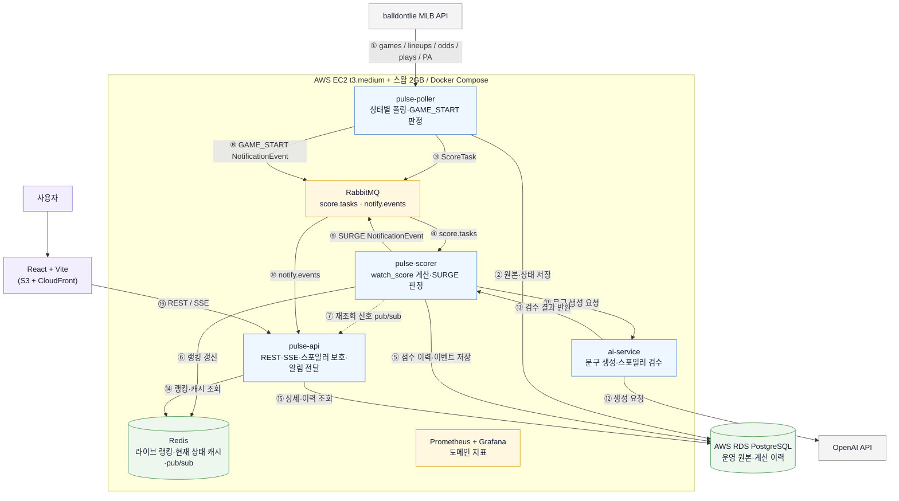
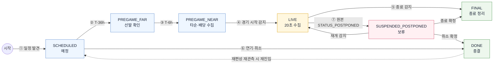
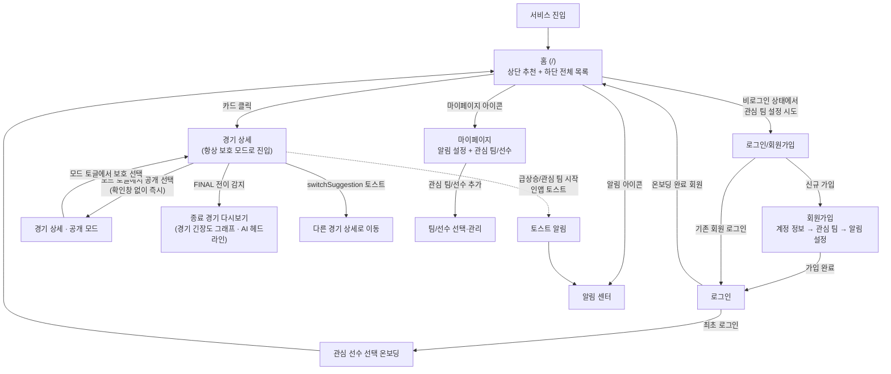
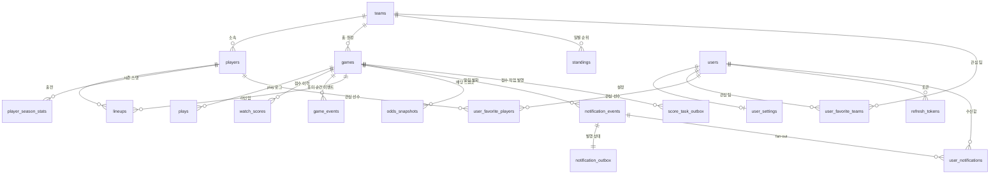
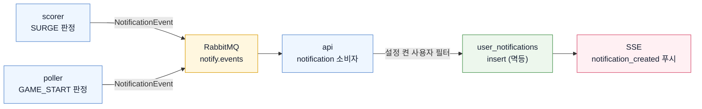

<p align="center">
  
</p>

<p align="center"><strong>스포일러 프리 MLB 관전 타이밍 추천 서비스</strong></p>

<p align="center"><a href="https://pulsemlb.com">https://pulsemlb.com</a></p>

## 핵심 기능

<!-- 기능별 스크린샷·GIF 추가 예정 -->

| 문제 | 해결 |
|---|---|
| 동시에 진행되는 여러 경기 중 지금 볼 경기를 고르기 어렵다. | **실시간 경기 추천** — 진행 중인 경기의 관전 가치를 계산해 지금 볼 만한 순서로 보여준다. 로그인 사용자는 관심 팀·선수에 따라 개인화된 순서를 볼 수 있다. |
| 경기 흐름을 확인하는 과정에서 점수와 결과를 먼저 알게 된다. | **스포일러 보호와 공개** — 진행 중·종료 경기 모두 보호 모드로 시작한다. 보호 모드에서는 점수와 승패를 숨긴 경기 흐름을 보여주며, 종료 경기에는 AI 헤드라인·경기 긴장도 그래프·보호 안전 이벤트를 제공한다. 사용자가 공개로 전환하면 점수와 상세 결과를 볼 수 있다. |
| 경기를 계속 확인하지 않으면 볼 만한 순간이나 다른 경기의 상승 흐름을 놓치기 쉽다. | **관전 타이밍 알림** — 급상승 경기와 관심 팀 경기 시작을 인앱 토스트와 알림 센터로 알려준다. 경기 상세를 보고 있을 때 더 볼 만한 경기가 생기면 토스트로 이동을 제안한다. |

## 역할 분담

| 담당자 | 역할 |
|---|---|
| 예은 | 데이터 파이프라인, 점수·추천, 홈, 공통 구조 |
| 창현 | AI 문구 생성·검수 |
| 민석 | 경기 상세, 다시보기, 전환 알림 |
| 윤호 | 회원, 알림, 통합 후 관측 |

세부 경계와 일정은 [ROLES_AND_SCHEDULE.md](docs/team/ROLES_AND_SCHEDULE.md)를 따른다.

## 기술 스택

| 영역 | 기술 |
|---|---|
| Frontend | React 19, TypeScript, Vite, Tailwind CSS v4, TanStack Query, react-router v8 |
| Backend | Java 21, Spring Boot, Spring Data JPA, Flyway |
| Data | PostgreSQL 16, Redis 7 |
| AI | Python, FastAPI, Pydantic, OpenAI API |
| 실시간 | Server-Sent Events(SSE) |
| Infra | Docker Compose, AWS EC2·RDS·S3 |

## 저장소 구조

```text
pulse-project/
├── frontend/      # React 웹 애플리케이션
├── backend/       # 수집·점수화·랭킹·REST API
├── ai-service/    # AI 문구 생성·스포일러 검수
├── raw-archive/   # 원본 데이터 수집·백필·분석
├── infra/         # 인프라 구성(local: 로컬 개발용, prod: AWS 운영)
└── docs/          # 제품·설계·가이드·팀 문서
```

전체 문서 색인은 [docs/README.md](docs/README.md)를 따른다. 로컬 실행은 [로컬 인프라 가이드](docs/guide/LOCAL_ENV.md)를 따른다.

## 전체 아키텍처



번호별 상세는 [ARCHITECTURE.md](docs/architecture/ARCHITECTURE.md)를 따른다.

## 경기 상태별 수집 흐름



상태별 수집 주기와 호출 예산은 [DATA_PIPELINE.md](docs/data/DATA_PIPELINE.md)를 따른다.

## 사용자 흐름



화면별 레이아웃과 상태는 [USER_FLOW.md](docs/product/USER_FLOW.md)를 따른다.

## DB 스키마



테이블 스키마와 키 기준은 [DB_SCHEMA.md](docs/data/DB_SCHEMA.md)를 따른다.

## 알림 파이프라인



판정 조건과 이벤트 스키마는 [NOTIFICATIONS.md](docs/policy/NOTIFICATIONS.md)를 따른다.
