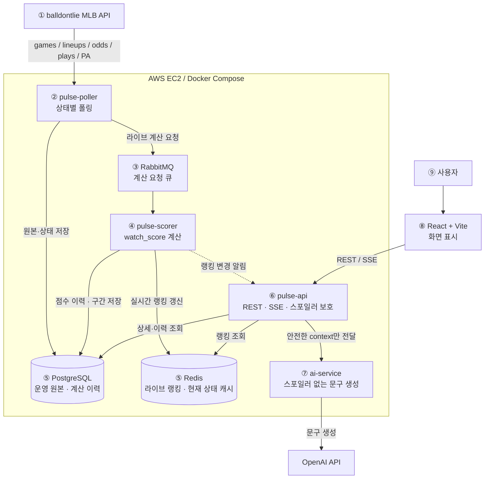
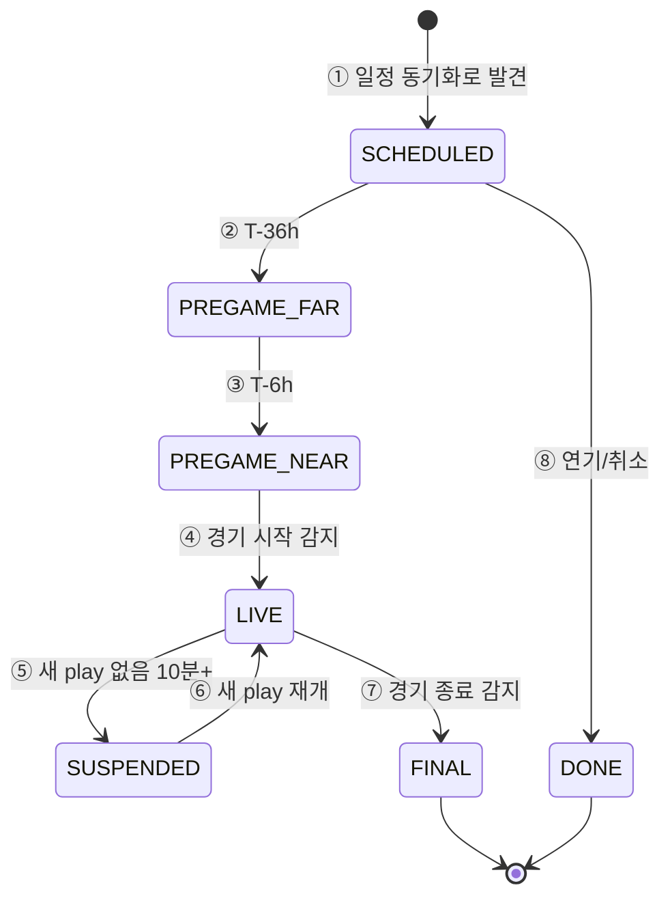
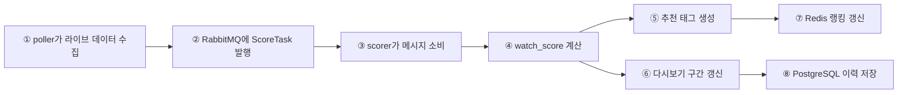
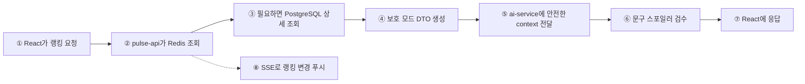

# PULSE 아키텍처와 데이터 처리 흐름

이 문서는 PULSE가 야구 경기 데이터를 어떻게 수집하고, 점수를 계산하고, 사용자에게 추천으로 보여주는지 한 흐름으로 설명한다.

## 1. 한 줄 요약

PULSE는 외부 MLB API를 계속 확인하다가, 경기 상태에 맞게 필요한 데이터만 수집하고, Spring Boot가 추천 점수를 계산한 뒤, Redis와 PostgreSQL에 저장된 결과를 API와 SSE로 클라이언트에 전달한다.

```text
외부 API -> 수집 -> 저장 -> 계산 -> 실시간 랭킹 -> API 응답 -> 화면/알림
```

## 2. 전체 구조



### 번호별 역할

| 번호 | 요소 | 역할 |
|---|---|---|
| ① | `balldontlie MLB API` | 경기 일정, 상태, play, 타석, 선발, 배당 데이터를 제공하는 외부 API |
| ② | `pulse-poller` | 경기 상태를 보고 필요한 API만 주기적으로 호출한다. 수집한 원본과 상태를 PostgreSQL에 저장하고, 계산이 필요하면 RabbitMQ에 메시지를 보낸다. |
| ③ | `RabbitMQ` | poller와 scorer를 분리한다. poller가 잠깐 빨리 수집해도 scorer가 순서대로 계산할 수 있게 완충 역할을 한다. |
| ④ | `pulse-scorer` | `watch_score`, 추천 태그, 다시보기 구간을 계산한다. |
| ⑤ | `PostgreSQL / Redis` | PostgreSQL은 오래 남길 운영 원본과 계산 이력을 저장한다. Redis는 지금 화면에 바로 보여줄 라이브 랭킹과 현재 상태만 빠르게 보관한다. |
| ⑥ | `pulse-api` | 프론트가 호출하는 서버다. REST 응답과 SSE 실시간 푸시를 제공하고, 스포일러 보호 모드에서는 점수·승패·우세 정보를 숨긴다. |
| ⑦ | `ai-service` | 추천 여부를 판단하지 않는다. Spring Boot가 넘긴 스포일러 없는 context로 제목, 이유, 알림, 리플레이 요약 문구만 만든다. |
| ⑧ | `React + Vite` | 사용자가 보는 화면이다. 직접 외부 MLB API를 호출하지 않고 `pulse-api`만 호출한다. |
| ⑨ | 사용자 | 보호 모드 또는 공개 모드로 추천 경기, 알림, 다시보기 구간을 본다. |

## 3. 경기 상태별 수집 흐름

`PREGAME_FAR`·`PREGAME_NEAR` 같은 이름은 별도 시스템이 아니라 ② `pulse-poller` 안에서 수집 강도를 정하기 위한 기준이다. ①은 개별 경기의 상태가 아니라 전체 슬레이트를 상시 감시하는 동작이며, 이 감시로 `SCHEDULED` 경기를 발견하고 이후 모든 상태 전이를 감지한다.



### 상태 번호별 의미와 수집

| 번호 | 상태 | poller가 하는 일 | 주기 |
|---|---|---|---|
| ① | 상시 (모든 경기 대상, `SCHEDULED` 포함) | `/games`로 어제·오늘 경기를 확인해 신규 경기, 상태 전이, 연기·취소를 감지한다. 특정 경기의 상태가 아니라 시스템 전체에 라이브 경기가 있는지로 주기가 갈린다. | `/games`: 라이브 경기 1개 이상이면 20초, 0개면 10분 |
| ② | `PREGAME_FAR` (T-36h~T-6h) | 선발 예상 투수 등장을 확인한다. | `/lineups`: 1시간 |
| ③ | `PREGAME_NEAR` (T-6h~시작) | `/lineups`는 타순 확정을, `/odds`는 `pregame_score`의 접전 기대 재료를 모은다. | `/lineups`: 15분 · `/odds`: 30분 |
| ④ | `LIVE` | `/games`는 ①과 같은 사이클로 점수·이닝을 갱신하고, `/plays`는 cursor 증분, `/plate_appearances`는 전체 재조회 후 dedupe한다. 수집 후 RabbitMQ로 계산 요청을 보낸다. | `/games`: 20초 · `/plays`: 20초 · `/plate_appearances`: 20초 |
| ⑤ | `SUSPENDED` | 새 play가 없으면 `/plays` 수집만 낮추고, ①의 `/games`로 재개를 감지한다. | `/plays`: 5분 |
| ⑥ | `LIVE` 재개 | 새 play 감지 시 ④의 주기로 복귀한다. | `/plays`: 20초 |
| ⑦ | `FINAL` | 열린 다시보기 구간을 마감하고 경기 상태만 종료로 바꾼다. 별도 재분석은 하지 않는다. | 종료 시 1회 |
| ⑧ | `DONE` | 연기·취소 경기는 랭킹에서 제거한다. | 감지 시 1회 |

## 4. 계산 흐름



### 계산 번호별 설명

| 번호 | 단계 | 설명 |
|---|---|---|
| ① | 라이브 데이터 수집 | `plays`, `plate_appearances`, 현재 경기 상태를 모은다. |
| ② | 계산 요청 발행 | 새 데이터가 들어오면 `ScoreTask`를 RabbitMQ에 넣는다. |
| ③ | 메시지 소비 | `pulse-scorer`가 계산할 경기 ID와 시점을 받는다. |
| ④ | `watch_score` 계산 | 접전, 후반부, 득점권, 최근 이벤트, 투수 흔들림 같은 신호를 점수로 바꾼다. |
| ⑤ | 추천 태그 생성 | 화면에 보여줄 짧은 이유 태그를 만든다. 예: `접전`, `득점권`, `후반 승부처` |
| ⑥ | 다시보기 구간 갱신 | 일정 점수 이상이면 구간을 열고, 낮아지면 닫는다. |
| ⑦ | Redis 갱신 | 진행 중 경기의 실시간 랭킹을 갱신한다. |
| ⑧ | PostgreSQL 저장 | 점수 이력과 다시보기 구간을 남긴다. |

## 5. 저장 기준

### PostgreSQL

오래 남겨야 하는 데이터와 분석 결과를 저장한다.

| 테이블 | 성격 | 저장 내용 |
|---|---|---|
| `games` | 최신 스냅샷 | 경기 상태, 이닝, 점수, `pregame_score`, `peak_base_score` |
| `plays` | append 로그 | 새 play 이벤트와 최초 관측 시각 |
| `watch_scores` | append 로그 | `base_score`, `watch_score`, 신호별 기여, 추천 태그 |
| `replay_segments` | 확정 결과 | 다시보기 구간 범위, 최고 점수, 구간 태그 |
| `user_preferences` | 사용자 설정 | 관심 팀/선수, 알림 설정, 스포일러 기본값 |

### Redis

자주 바뀌고 빠르게 읽어야 하는 현재 상태만 저장한다.

| 키 | 내용 |
|---|---|
| `score:rank:live` | 진행 중 경기의 `watch_score` 랭킹 |
| `game:{id}:live` | 현재 점수, 이닝, 노출 태그, 최신 문구 캐시 |

핵심 기준은 단순하다.

```text
PostgreSQL = 오래 남길 원본과 이력
Redis = 지금 화면에 바로 필요한 최신 상태
```

## 6. 사용자 응답 흐름



### 응답 번호별 설명

| 번호 | 단계 | 설명 |
|---|---|---|
| ① | 랭킹 요청 | 프론트는 `pulse-api`만 호출한다. |
| ② | Redis 조회 | 라이브 랭킹은 Redis에서 빠르게 읽는다. |
| ③ | 상세 조회 | 경기 상세, 이력, 다시보기 구간은 PostgreSQL에서 읽는다. |
| ④ | 보호 모드 DTO 생성 | 스포일러가 될 수 있는 점수, 승패, 우세 정보는 서버에서 제거한다. |
| ⑤ | AI 문구 요청 | AI에는 이미 안전하게 걸러진 context만 보낸다. |
| ⑥ | 스포일러 검수 | 생성 문구에 점수·승패·우세 암시가 있으면 기본 문구로 대체한다. |
| ⑦ | 화면 응답 | React는 서버가 준 안전한 응답을 그대로 표시한다. |
| ⑧ | SSE 푸시 | 랭킹이 바뀌면 새로고침 없이 화면을 갱신한다. |

## 7. 운영 흐름 요약

| 구간 | 한 줄 흐름 |
|---|---|
| 경기 전 | `poller`가 선발·배당·일 배치 데이터를 모음 -> `pregame_score` 계산 -> PostgreSQL 저장 |
| 경기 중 | `poller`가 20초 단위로 라이브 데이터 수집 -> RabbitMQ -> `scorer` 계산 -> Redis 랭킹 갱신 -> SSE 푸시 |
| 경기 종료 | `FINAL` 감지 -> 열린 구간 마감 -> 상태 변경 -> 라이브 중 저장된 `peak_base_score`와 구간으로 다시보기 제공 |
| AI 문구 | `pulse-api`가 안전한 context만 `ai-service`에 전달 -> 문구 생성 -> 스포일러 검수 -> 응답 |

## 8. 설계 원칙

1. 외부 MLB API는 서버에서만 호출한다. 프론트는 직접 호출하지 않는다.
2. 추천 판단은 Spring Boot가 한다. AI 서버는 문구만 만든다.
3. 스포일러 보호는 프론트가 아니라 서버 응답 단계에서 강제한다.
4. PostgreSQL에는 오래 남길 데이터, Redis에는 실시간 조회용 데이터만 둔다.
5. 경기 종료 후 다시 크게 재분석하지 않는다. 라이브 중 계산한 이력과 구간을 사용한다.

## 9. 개발용 S3 수집

운영 흐름과 별도로, 개발·백테스트용 원본 데이터는 S3에 저장한다.

```text
S3 = 운영 서비스용 저장소가 아니라 개발과 백테스트용 원본 아카이브
```

| 구분 | 용도 |
|---|---|
| 라이브 아카이브 | 진행 중 경기를 원본 응답 그대로 저장한다. `observed_at`은 실제 관측 시각으로 사용한다. |
| 백필 데이터 | 과거 경기 분석용이다. `backfilled: true`로 표시하고 시간 기반 계산에는 사용하지 않는다. |
| 백테스트 | S3 원본을 로컬/배치 스크립트로 읽어 `scoring.yml`을 튜닝한다. 운영 DB에는 넣지 않는다. |
