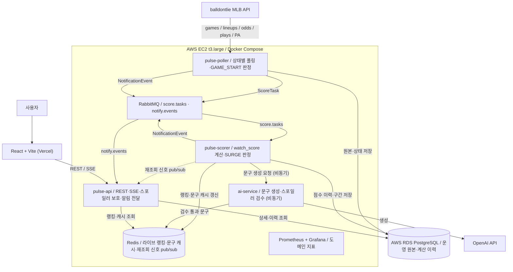
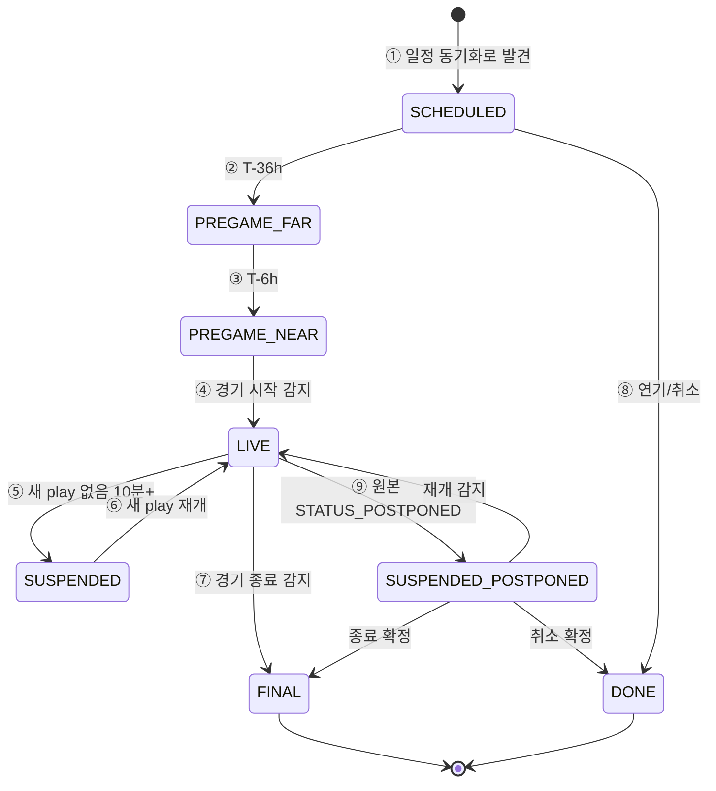
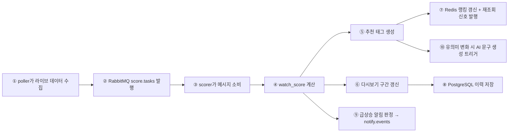
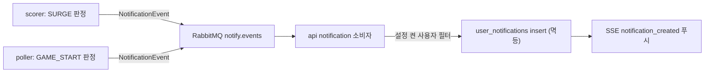
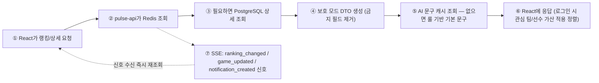

# PULSE 아키텍처와 데이터 처리 흐름

이 문서는 PULSE가 야구 경기 데이터를 어떻게 수집하고, 점수를 계산하고, 사용자에게 추천으로 보여주는지 한 흐름으로 설명한다. 컴포넌트 배치와 채널 선택의 **이유**를 함께 기록한다. 모듈 간 상세 계약(DTO 필드·이벤트 스키마)은 [API_CONTRACTS.md](API_CONTRACTS.md)가 단일 기준이다.

## 1. 한 줄 요약

PULSE는 외부 MLB API를 계속 확인하다가, 경기 상태에 맞게 필요한 데이터만 수집하고, Spring Boot가 추천 점수를 계산한 뒤, Redis와 PostgreSQL에 저장된 결과를 API와 SSE로 클라이언트에 전달한다.

```text
외부 API -> 수집(poller) -> RabbitMQ -> 계산(scorer) -> Redis 랭킹/PostgreSQL 이력 -> API 응답/SSE 신호 -> 화면/알림
```

## 2. 전체 구조



### 컴포넌트 배치의 이유

| 컴포넌트 | 역할 | 왜 이렇게 나눴나 |
|---|---|---|
| `pulse-api` | REST 응답, SSE 푸시, 보호 모드 DTO 강제, 알림 fan-out·저장 | 사용자 요청·SSE 연결은 지연에 민감하고, 사용자 설정을 아는 유일한 곳이라 알림 "전달"도 여기서 한다 |
| `pulse-poller` | 경기 상태별 폴링, 원본 저장, ScoreTask 발행, LIVE 전이 감지(경기 시작 알림 판정) | 외부 API I/O·레이트리밋·백오프라는 고유 실패 모드를 가진다. 장애가 나도 api·scorer에 전파되지 않는다 |
| `pulse-scorer` | `watch_score`·태그·다시보기 구간 계산, 급상승 알림 판정, AI 문구 생성 트리거 | 점수 이력과 히스테리시스 상태를 가진 유일한 곳이라 "판정"이 여기 있다. 계산 버그·부하가 폴링 주기에 영향을 주지 않는다 |
| `RabbitMQ` | `score.tasks`(계산 요청), `notify.events`(알림 이벤트) | 유실되면 복구 불가능한 작업 전달용. ack·재전달·DLQ 제공 |
| `Redis` | 라이브 랭킹(ZSET), 현재 상태·문구 캐시, 재조회 신호 pub/sub, 쿨다운·레이트리밋 키 | 유실돼도 재계산·다음 사이클로 복구되는 것만 둔다 |
| `RDS PostgreSQL` | 운영 원본·계산 이력·사용자·알림 저장 | 라이브 1회 계산 결과는 재생성 불가라 관리형 백업이 필요하다 |
| `ai-service` | 추천 판단 없이, 서버가 넘긴 스포일러 세이프 context로 문구 생성·검수 | 응답 경로 밖(비동기+캐시)이라 장애가 사용자 응답에 영향 없다 |

**배치 원칙 요약**: 판정은 데이터 옆에서(SURGE=scorer, GAME_START=poller), 전달은 사용자 옆에서(fan-out·SSE=api). 채널은 **유실 불가 작업 = RabbitMQ, 유실 허용 신호 = Redis Pub/Sub**.

## 3. 경기 상태별 수집 흐름

`PREGAME_FAR`·`PREGAME_NEAR` 같은 이름은 별도 시스템이 아니라 `pulse-poller` 안에서 수집 강도를 정하기 위한 기준이다. ①은 개별 경기의 상태가 아니라 전체 슬레이트를 상시 감시하는 동작이며, 이 감시로 `SCHEDULED` 경기를 발견하고 이후 모든 상태 전이를 감지한다.



### 상태 번호별 의미와 수집

| 번호 | 상태 | poller가 하는 일 | 주기 |
|---|---|---|---|
| ① | 상시 (모든 경기 대상, `SCHEDULED` 포함) | `/games`로 어제·오늘 경기를 확인해 신규 경기, 상태 전이, 연기·취소를 감지한다. 특정 경기의 상태가 아니라 시스템 전체에 라이브 경기가 있는지로 주기가 갈린다. | `/games`: 라이브 경기 1개 이상이면 20초, 0개면 10분 |
| ② | `PREGAME_FAR` (T-36h~T-6h) | 선발 예상 투수 등장을 확인한다. | `/lineups`: 1시간 |
| ③ | `PREGAME_NEAR` (T-6h~시작) | `/lineups`는 타순 확정을, `/odds`는 `pregame_score`의 접전 기대 재료를 모은다. | `/lineups`: 15분 · `/odds`: 30분 |
| ④ | `LIVE` | `/games`는 ①과 같은 사이클로 점수·이닝을 갱신하고, `/plays`는 cursor 증분, `/plate_appearances`는 전체 재조회 후 dedupe한다. 수집 후 RabbitMQ로 계산 요청을 보낸다. LIVE 전이 감지 시 `GAME_START` 알림 이벤트를 발행한다. | `/games`: 20초 · `/plays`: 20초 · `/plate_appearances`: 20초 |
| ⑤ | `SUSPENDED` | 새 play가 없으면 `/plays` 수집만 낮추고, ①의 `/games`로 재개를 감지한다. | `/plays`: 5분 |
| ⑥ | `LIVE` 재개 | 새 play 감지 시 ④의 주기로 복귀한다. | `/plays`: 20초 |
| ⑦ | `FINAL` | 경기 종료를 감지하면 `lifecycleState=FINAL`을 실은 종료 ScoreTask를 발행한다. 열린 다시보기 구간 마감·라이브 랭킹(`score:rank:live`) 제거·`signal:ranking` 발행은 scorer가 수행한다(§4). 별도 재분석은 하지 않는다. | 감지 시 1회 |
| ⑧ | `DONE` | 연기·취소를 감지하면 `lifecycleState=DONE`을 실은 종료 ScoreTask를 발행한다. 랭킹 제거는 scorer가 수행한다. | 감지 시 1회 |
| ⑨ | `SUSPENDED_POSTPONED` | 라이브 중 원본 `STATUS_POSTPONED`(서스펜디드 게임)를 감지하면 `lifecycleState=SUSPENDED_POSTPONED`을 실은 종료 ScoreTask를 발행한다. scorer는 라이브 랭킹에서 제거하되 열린 다시보기 구간은 닫지 않고 보류한다. 이후 재개(`STATUS_IN_PROGRESS`)·종료(`STATUS_FINAL`)·취소(`STATUS_CANCELED`)를 ①의 감시로 받아 각 상태로 보낸다. `DONE`이나 `FINAL`로 바로 보내지 않는 이유: 재개 시 이력이 끊기거나 종료 경기로 잘못 노출되는 것을 막기 위해서다. | 감지 시 1회, 이후 ① 주기 |

**일정 룩어헤드**: ①의 어제·오늘(UTC) 감시와 별도로, 향후 2~3일 일정을 저빈도(6~12시간 주기)로 동기화해 미래 경기와 시작 시각을 미리 확보한다. balldontlie `/games`는 최소 7일 뒤까지 일정을 제공하고, 미래 경기도 `date`에 실제 시작 시각(UTC ISO 8601)을 담는다(실측). 확보한 시작 시각으로 `SCHEDULED → PREGAME_FAR`(T-36h) `→ PREGAME_NEAR`(T-6h) 전이 시점을 예약한다. 시작 시각은 확정 전 변동될 수 있으므로 룩어헤드 동기화마다 갱신하고, 시작 시각 미정(TBD) 경기는 전이 예약을 보류한 뒤 다음 동기화에서 재확인한다.

## 4. 계산 흐름




### 계산 번호별 설명

| 번호 | 단계 | 설명 |
|---|---|---|
| ① | 라이브 데이터 수집 | `plays`, `plate_appearances`, 현재 경기 상태를 모은다. |
| ② | 계산 요청 발행 | 새 데이터가 들어오면 `ScoreTask`를 RabbitMQ `score.tasks`에 넣는다. 유실 시 해당 시점 이력이 영구 공백이 되므로 브로커로 보낸다. |
| ③ | 메시지 소비 | `pulse-scorer`가 계산할 경기 ID와 시점을 받는다. 처리 실패 메시지는 재전달 후 DLQ로 이동한다. |
| ④ | `watch_score` 계산 | 접전, 후반부, 득점권, 최근 이벤트 같은 랭킹 신호를 점수로 바꾼다. |
| ⑤ | 추천 태그 생성 | 화면에 보여줄 짧은 이유 태그를 만든다. 예: `접전 흐름`, `득점권 압박`, `후반 긴장 구간` ([RECOMMENDATION_POLICY.md](RECOMMENDATION_POLICY.md) §2 기준) |
| ⑥ | 다시보기 구간 갱신 | 일정 점수 이상이면 구간을 열고, 낮아지면 닫는다. |
| ⑦ | Redis 갱신 + 신호 | 실시간 랭킹을 갱신하고 `signal:ranking`·`signal:game:{id}` 채널로 재조회 신호를 발행한다. api가 이를 SSE로 중계한다. |
| ⑧ | PostgreSQL 저장 | 점수 이력과 다시보기 구간을 남긴다. |
| ⑨ | 급상승 알림 판정 | 히스테리시스(85 진입 발화 / 70 미만 재무장)와 급등 조건(최근 5분 +15 이상)을 통과하면 `notify.events`로 알림 이벤트를 발행한다. 판정이 scorer에 있는 이유: 점수 이력과 히스테리시스 상태를 가진 유일한 곳이기 때문이다. |
| ⑩ | AI 문구 트리거 | 태그 세트 변화·추천 상태 진입 같은 유의미한 변화가 있을 때만 스포일러 세이프 context로 ai-service에 비동기 생성을 요청한다. |

scorer는 `lifecycleState`가 `FINAL`·`DONE`·`SUSPENDED_POSTPONED`인 종료 ScoreTask를 받으면 라이브 계산 대신 종료 정리를 수행한다: 열린 다시보기 구간 마감(`SUSPENDED_POSTPONED`은 보류), `score:rank:live`에서 제거, `signal:ranking` 발행. 종료 정리는 경기 상태 전이 기준으로 멱등하며, 이미 정리된 경기의 종료 ScoreTask를 다시 받아도 재실행하지 않는다.


## 5. 알림 파이프라인

알림은 **판정과 전달을 분리**한다. 판정은 데이터를 가진 곳(scorer·poller)에서, 전달은 사용자를 아는 곳(api)에서 한다.



- 채널이 RabbitMQ인 이유: 알림은 one-shot이라 유실되면 복구 경로가 없다. 재조회 신호와 달리 "다음 사이클에 자연 복구"가 성립하지 않는다.
- 중복 전달을 전제로 `(event_id, user_id)` 유니크 제약으로 멱등 처리한다.
- 전역 15분 1회 레이트리밋은 발행 측(scorer)이 Redis 키로 관리한다.
- 경기 전환 안내는 알림 파이프라인을 타지 않는다. 상세 API 응답의 `switchSuggestion` 필드로 제공한다(계약은 [API_CONTRACTS.md](API_CONTRACTS.md)).

## 6. 저장 기준

### PostgreSQL (RDS)

오래 남겨야 하는 데이터와 분석 결과를 저장한다. 스키마 상세는 [DB_SCHEMA.md](DB_SCHEMA.md).

| 테이블 | 성격 | 저장 내용 |
|---|---|---|
| `games` | 최신 스냅샷 | 경기 상태, 이닝, 점수, `pregame_score`, `peak_base_score` |
| `plays` | append 로그 | 새 play 이벤트와 최초 관측 시각 |
| `odds_snapshots` | 경기 전 스냅샷 | 벤더별 배당. `FIRST_SEEN`·`PREGAME_FINAL` 두 개만, 시작 전 관측만 허용 |
| `watch_scores` | append 로그 | `base_score`, `watch_score`, 신호별 기여, 추천 태그 |
| `replay_segments` | 확정 결과 | 다시보기 구간 범위, 최고 점수, 구간 태그 |
| `users` · `refresh_tokens` | 계정 | 인증 정보, 리프레시 토큰 상태 |
| `user_preferences` | 사용자 설정 | 관심 팀/선수, 알림 설정 |
| `notification_events` · `user_notifications` | 알림 | 전역 이벤트 원본 1행 + 사용자별 수신함(읽음 상태, 7일 보관) |

### Redis

자주 바뀌고 빠르게 읽어야 하는 현재 상태만 저장한다. 키 명세는 [API_CONTRACTS.md](API_CONTRACTS.md).

| 키 | 내용 |
|---|---|
| `score:rank:live` | 진행 중 경기의 `watch_score` 랭킹 (ZSET) |
| `game:{id}:live` | 현재 점수, 이닝, 노출 태그 캐시 |
| `game:{id}:copy:{purpose}` | 검수 통과한 AI 문구 캐시 |
| `notify:*`, `switch:cooldown:*` | 알림 히스테리시스·레이트리밋·전환 안내 쿨다운 |
| (pub/sub) `signal:ranking`, `signal:game:{id}` | 재조회 신호 채널 |

핵심 기준은 단순하다.

```text
PostgreSQL(RDS) = 오래 남길 원본과 이력 — 잃으면 재생성 불가
Redis = 지금 화면에 필요한 최신 상태 — 잃어도 재계산 가능
```

## 7. 사용자 응답 흐름

AI 문구 생성은 응답 경로에 없다. 계산 파이프라인이 미리 만들어 캐시에 넣어두고, API는 캐시를 읽기만 한다.



### 응답 번호별 설명

| 번호 | 단계 | 설명 |
|---|---|---|
| ① | 요청 | 프론트는 `pulse-api`만 호출한다. 상세는 현재 모드(`PROTECTED`/`REVEALED`)를 파라미터로 보낸다. |
| ② | Redis 조회 | 라이브 랭킹·문구 캐시를 빠르게 읽는다. |
| ③ | 상세 조회 | 경기 상세, 이력, 다시보기 구간은 PostgreSQL에서 읽는다. |
| ④ | 보호 모드 DTO 생성 | 스포일러가 될 수 있는 필드는 서버에서 제거한다. 금지 필드 목록은 [API_CONTRACTS.md](API_CONTRACTS.md)와 직렬화 가드 테스트가 같은 기준을 본다. |
| ⑤ | 문구 조회 | 검수를 통과한 AI 문구가 캐시에 있으면 사용, 없으면 룰 기반 기본 문구. 소비자는 폴백 여부를 모른다. |
| ⑥ | 화면 응답 | 개인화(관심 팀/선수 가산)는 이 시점에 서버가 적용한다. 공용 랭킹은 하나만 유지한다. |
| ⑦ | SSE 신호 | payload에 데이터를 싣지 않는 재조회 신호만 보낸다. 클라이언트는 신호 수신 즉시 재조회하므로 체감은 푸시와 동일하고, 스포일러 필터링 지점은 REST 한 곳에 유지된다. |

## 8. 운영 흐름 요약

| 구간 | 한 줄 흐름 |
|---|---|
| 경기 전 | `poller`가 선발·배당·일 배치 데이터를 모음 -> `pregame_score` 계산 -> PostgreSQL 저장 |
| 경기 중 | `poller` 20초 수집 -> RabbitMQ -> `scorer` 계산 -> Redis 랭킹 갱신 -> 재조회 신호 -> SSE |
| 알림 | `scorer`/`poller` 판정 -> `notify.events` -> `api` fan-out·저장 -> SSE |
| AI 문구 | `scorer`가 유의미 변화 시 비동기 요청 -> 생성·검수 -> Redis 캐시 -> 다음 조회에 반영 |
| 경기 종료 | `poller`가 `FINAL` 감지 -> 종료 ScoreTask 발행 -> `scorer`가 열린 구간 마감·랭킹 제거·`signal:ranking` -> 라이브 중 저장된 `peak_base_score`와 구간으로 다시보기 제공 |


## 9. 설계 원칙

1. 외부 MLB API는 서버에서만 호출한다. 프론트는 직접 호출하지 않는다.
2. 추천 판단은 Spring Boot가 한다. AI 서버는 문구만 만든다.
3. 스포일러 보호는 프론트가 아니라 서버 응답 단계에서 강제한다. 필터링 지점은 REST DTO 한 곳이다(SSE는 데이터를 싣지 않는다).
4. PostgreSQL에는 오래 남길 데이터, Redis에는 실시간 조회용 데이터만 둔다. 관리형(RDS) 비용은 재생성 불가능한 데이터에만 쓴다.
5. 경기 종료 후 다시 크게 재분석하지 않는다. 라이브 중 계산한 이력과 구간을 사용한다.
6. 채널 선택 기준: 유실 불가 작업은 RabbitMQ, 유실 허용 신호는 Redis Pub/Sub.
7. 판정은 데이터를 가진 컴포넌트에서, 전달은 사용자를 아는 컴포넌트에서 한다.

## 10. S3 임시 수집과 운영 DB 이전

운영 데이터 경로는 운영 `poller` → RDS 적재 + ScoreTask 발행으로 일원화한다. S3 아카이브는 DB 이전 전까지의 개발·데이터 파악·백테스트용 **임시 수집**이며, 운영 이전이 완료되면 아카이빙을 중단한다.

```text
S3 = 운영 서비스용 저장소가 아니라 개발·백테스트용 임시 원본 아카이브 (운영 이전 후 중단)
```

**이전 계획(임시 수집 → 운영 이전 → 중단 → 보존)**

1. 임시 수집: raw-archive Lambda가 라이브·백필 원본을 S3에 저장한다(현행).
2. 스키마 준비: Flyway 베이스라인 V1과 이전 데이터 구분용 `source` 컬럼([DB_SCHEMA.md](DB_SCHEMA.md) §F)을 준비한다. 베이스라인 V1은 이전보다 앞서 확정한다.
3. 운영 이전: 운영 `poller`가 RDS 적재 + ScoreTask 발행으로 데이터 공급을 일원화한다. 기존 S3 수집분(라이브 아카이브·백필)은 운영 스키마로 변환해 RDS로 이전하고, `source`로 운영 수집분과 구분 표기한다. 이전한 plays로 scorer를 1회 재생해 과거 경기의 `watch_scores`·`replay_segments`를 채운다.
4. 중단: **DB 이전이 완료되고 운영 `poller` 정상 동작이 확인되면 즉시** raw-archive의 S3 아카이빙을 중단한다. 운영 `poller`와 S3 수집기가 동시에 balldontlie API를 호출하면 호출 예산(600 req/min)이 이중 소모되기 때문이다.
5. 보존: 이전한 데이터는 폐기하지 않고 운영 DB에 영속한다. 라이브 아카이브(`observed_at` 실측)는 이전으로 보존되고, 백필(과거 시즌)은 API 재수집으로도 재생성할 수 있다. 백테스트는 이전 후 운영 DB 이력으로 수행한다([RECOMMENDATION_SCORE.md](RECOMMENDATION_SCORE.md) §8).

**일정**: DB 이전은 최대한 빨리 진행한다. 배포 목표는 7/15이며 가능한 한 조기 진행한다. 이전은 Flyway 베이스라인 V1이 선행 조건이다.

**후속 항목**: ONBOARDING.md를 DB 이전 완료 후 단계별 따라하기 형식으로 갱신한다(현재 S3 리플레이 절차를 운영 DB 기준으로 대체).

| 구분 | 용도 |
|---|---|
| 라이브 아카이브 | 진행 중 경기를 원본 응답 그대로 저장한다. `observed_at`은 실제 관측 시각으로 사용한다. 이전 시 `source=S3_LIVE_ARCHIVE`로 표기한다. |
| 백필 데이터 | 과거 경기 분석용이다. `backfilled: true`로 표시하고 시간 기반 계산에는 사용하지 않는다. 이전 시 `source=S3_BACKFILL`로 표기한다. |
| 백테스트 | 이전 후 운영 DB 이력으로 `scoring.yml`을 튜닝한다. 가중치 변경 시 영향 리포트를 생성한다([RECOMMENDATION_SCORE.md](RECOMMENDATION_SCORE.md) §8). |
