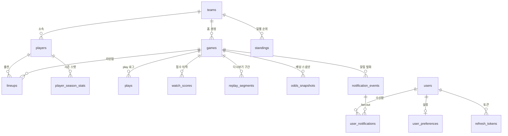

# DB 모델 스키마 설계

이 문서는 PULSE 운영 데이터베이스(PostgreSQL)의 테이블 스키마를 정의한다. 타입은 PostgreSQL과 Spring Data JPA 기준이며, 가중치와 임계값은 DB가 아니라 `backend/src/main/resources/scoring.yml`에서 관리한다.

## 1. 명명·타입 규칙

| 규칙 | 내용 |
|---|---|
| 명명 | 테이블·컬럼은 `snake_case`. balldontlie 원본 필드명을 최대한 유지한다. |
| 식별자 | balldontlie가 부여한 전역 id(`game_id`, `team_id`, `player_id`, play `order`, lineup id, odds id)를 그대로 PK 또는 자연키로 쓴다. 모두 큰 정수라 `BIGINT`. |
| 시각 | 모든 시각 컬럼은 `TIMESTAMPTZ`(UTC 저장). balldontlie `date`·`updated_at`은 UTC ISO 8601이다. |
| `observed_at` | plays·PA에 **벽시계 타임스탬프가 없으므로** 폴러의 **최초 관측 시각**을 저장해 시간 감쇠(최근 득점·리드 변경)를 계산한다. 정밀도 하한은 폴링 주기(약 20초)다. |
| `backfilled` | 과거 백필로 적재한 행은 `true`. 시간 기반 계산에서 제외한다(백테스트는 order 윈도우로 근사). |
| `source` | 데이터 출처를 `OPERATIONAL`(기본)·`S3_LIVE_ARCHIVE`·`S3_BACKFILL`로 구분한다. S3에서 이전한 데이터를 운영 수집분과 구분하는 컬럼이며 상세는 §F. `backfilled`는 `source = 'S3_BACKFILL'`과 동치다. |
| 배열·구조 | 이닝별 점수·신호 기여·태그 등 가변 구조는 `JSONB` 또는 Postgres 배열 타입을 쓴다. |
| 상수 | 가중치·임계값·중요도 배수는 **DB에 저장하지 않는다.** `scoring.yml`에서 관리하고 변경 시 `version`을 올린다. |
| 스키마 관리 | 로컬은 `ddl-auto: update`, 배포 환경(RDS)은 **Flyway 마이그레이션만** 사용한다. 베이스라인 V1은 DB 이전에 앞서 만들고, 이후 변경은 증분 마이그레이션으로 리뷰를 거친다. |

## 2. 스포일러 보호 규칙

🔒 표시 컬럼은 **내부 계산 전용**이다. 점수·득점·승패·우세·라이브 배당·결과 텍스트가 여기에 해당한다. 보호 모드 DTO에서 반드시 제거하며 API·프론트로 그대로 내보내지 않는다. 스포일러 보호는 프론트가 아니라 **서버 응답 단계**에서 강제한다. 금지 필드 전체 목록과 화면별 노출 기준은 [API_CONTRACTS.md](API_CONTRACTS.md) §3이 단일 기준이며, 직렬화 가드 테스트와 동기화한다.

## 3. 전체 관계도 (ERD)



`user_preferences`는 `favorite_team_ids`·`favorite_player_ids` 배열로 `teams`·`players`를 앱 레벨에서 참조한다(물리 FK 미설정).

## 4. 테이블 개요

| 그룹 | 테이블 | 성격 | 우선순위 |
|---|---|---|---|
| 운영 핵심 | `games` | 최신 스냅샷(upsert) | P0 |
| 운영 핵심 | `plays` | append 로그 | P0 |
| 운영 핵심 | `watch_scores` | append 로그(시계열) | P0 |
| 운영 핵심 | `replay_segments` | 확정 결과 | P0 |
| 사용자 | `users` | 계정 | P0 |
| 사용자 | `refresh_tokens` | 토큰 상태 | P0 |
| 사용자 | `user_preferences` | 설정 | P0 |
| 알림 | `notification_events` | 전역 이벤트 원본 | P0 |
| 알림 | `user_notifications` | 사용자별 수신함 | P0 |
| 마스터 | `teams` | 정적 마스터 | P1 |
| 마스터 | `players` | 정적 마스터 | P1 |
| 경기 전 입력 | `lineups` | 선발·타순 | P1 |
| 경기 전 입력 | `odds_snapshots` | 시작 직전 스냅샷 | P1 |
| 경기 전 입력 | `standings` | 일 배치 순위 | P1 |
| 경기 전 입력 | `player_season_stats` | 일 배치·캐시 | P2 |

## A. 운영 핵심 테이블

### A-1. `games` — 최신 스냅샷

경기당 1행. `game_id`로 upsert하며 상태·점수·계산 결과의 최신 값만 유지한다.

| 컬럼 | 타입 | 설명 | 제약·비고 |
|---|---|---|---|
| `game_id` | `BIGINT` | balldontlie 경기 id | **PK** |
| `season` | `INT` | 시즌 연도 | |
| `season_type` | `TEXT` | `regular`/postseason 구분 | |
| `postseason` | `BOOLEAN` | 포스트시즌 여부 | 중요도 ×1.15 |
| `start_time` | `TIMESTAMPTZ` | 경기 시작(원본 `date`, UTC) | 생명주기 T-36h/T-6h 기준 |
| `status` | `TEXT` | 원본 상태 `STATUS_*` | 5종(SCHEDULED·IN_PROGRESS·FINAL·POSTPONED·CANCELED) |
| `lifecycle_state` | `TEXT` | 폴러 상태머신 값 | `SCHEDULED`…`DONE` |
| `period` | `SMALLINT` | 현재 이닝 | 후반/연장 신호 |
| `home_team_id` · `away_team_id` | `BIGINT` | 홈/원정팀 | FK → `teams` |
| `home_runs` · `away_runs` | `SMALLINT` | 팀별 득점 | 🔒 점수 차 신호 |
| `home_hits` · `away_hits` | `SMALLINT` | 팀별 안타 | 🔒 |
| `home_errors` · `away_errors` | `SMALLINT` | 팀별 실책 | 🔒 |
| `home_inning_scores` · `away_inning_scores` | `JSONB` | 이닝별 득점 배열 | 🔒 초반 난타·빅이닝 검증 |
| `venue` | `TEXT` | 경기장 | 표시용(스포일러 아님) |
| `attendance` | `INT` | 관중 수 | 표시용 |
| `pregame_score` | `SMALLINT` | 예정 정렬 점수 0–100 | 🔒 UI 노출 금지 |
| `peak_base_score` | `SMALLINT` | 라이브 중 최고 base_score | 🔒 종료 정렬 키 |
| `final_headline` | `TEXT` | 종료 경기 AI 헤드라인(검수 통과본) | 종료 후 확정, nullable |
| `last_play_order` | `BIGINT` | `/plays` 증분 커서(마지막 order) | |
| `last_polled_at` | `TIMESTAMPTZ` | 최근 폴링 시각 | |
| `observed_at` | `TIMESTAMPTZ` | 최신 상태 관측 시각 | |
| `source` | `TEXT` | 데이터 출처 | 기본 `OPERATIONAL` (§F) |
| `created_at` · `updated_at` | `TIMESTAMPTZ` | 생성/수정 시각 | |

**키·인덱스** — PK `game_id` · idx(`lifecycle_state`), idx(`start_time`), idx(`status`)

### A-2. `plays` — play 이벤트 append 로그

`/plays`를 order 커서로 증분 수집해 새 play만 추가한다. 다시보기 재생과 라이브 신호의 원천.

| 컬럼 | 타입 | 설명 | 제약·비고 |
|---|---|---|---|
| `id` | `BIGSERIAL` | 대리 PK | **PK** |
| `game_id` | `BIGINT` | 경기 | FK → `games` |
| `play_order` | `BIGINT` | 경기 내 순서(원본 `order`) | 증분 커서·구간 범위 |
| `type` | `TEXT` | 이벤트 타입 | 이닝 경계 감지 |
| `inning` | `SMALLINT` | 이닝 번호 | |
| `inning_type` | `TEXT` | `Top`/`Bottom`/`Mid` | |
| `text` | `TEXT` | play 설명 | 🔒 스포일러 검수 게이트 필요 |
| `home_score` · `away_score` | `SMALLINT` | play 후 점수 | 🔒 리드 변경 감지 |
| `scoring_play` | `BOOLEAN` | 득점 play 여부 | 최근 득점·빅이닝 |
| `score_value` | `SMALLINT` | 득점 수(1–3, 그 외 null) | |
| `outs` · `balls` · `strikes` | `SMALLINT` | 카운트 | 카운트/아웃 신호 |
| `batter_id` · `pitcher_id` | `BIGINT` | 타자/투수 | FK → `players`(nullable) |
| `pitch_type` | `TEXT` | 구종 | |
| `pitch_velocity` | `SMALLINT` | 구속(mph) | |
| `hit_coordinate_x` · `hit_coordinate_y` | `SMALLINT` | 타구 좌표 | 시각화(후순위) |
| `trajectory` | `TEXT` | 궤적 `F`/`P`/`G`/null | |
| `observed_at` | `TIMESTAMPTZ` | 최초 관측 시각 | 시간 감쇠 기준 |
| `backfilled` | `BOOLEAN` | 백필 여부 | 기본 `false` |
| `source` | `TEXT` | 데이터 출처 | 기본 `OPERATIONAL` (§F) |

**키·인덱스** — PK `id` · **UNIQUE(`game_id`, `play_order`)** · idx(`game_id`, `play_order`)

### A-3. `watch_scores` — 점수 이력 append 로그

라이브 폴링 사이클마다 1행. 시계열이라 시각별 점수 추이와 신호 기여를 남긴다.

| 컬럼 | 타입 | 설명 | 제약·비고 |
|---|---|---|---|
| `id` | `BIGSERIAL` | PK | **PK** |
| `game_id` | `BIGINT` | 경기 | FK → `games` |
| `computed_at` | `TIMESTAMPTZ` | 계산 시각(폴링 사이클 observed_at) | |
| `play_order` | `BIGINT` | 계산 기준 마지막 play order | |
| `inning` · `inning_type` | `SMALLINT` · `TEXT` | 계산 시점 이닝 | |
| `base_score` | `SMALLINT` | 8개 신호 합(보정 전) | 🔒 |
| `importance_multiplier` | `NUMERIC(4,2)` | 경기 중요도 배수 ×0.90–×1.15 | 🔒 |
| `pregame_bonus` | `NUMERIC(4,2)` | 사전 가산 `pregame_score/10`(0–10) | 🔒 |
| `watch_score` | `SMALLINT` | 최종 `clamp(raw, 0, 100)` | 🔒 랭킹 정렬 키 |
| `signal_contributions` | `JSONB` | 신호별 기여 맵 | 🔒 예: `{"후반연장":20,"점수차":15}` |
| `tags` | `TEXT[]` | 추천 이유 태그 | 예: `접전 흐름`, `득점권 압박`, `후반 긴장 구간` — 표기는 [RECOMMENDATION_POLICY.md](RECOMMENDATION_POLICY.md) §2 기준 |
| `backfilled` | `BOOLEAN` | 백필 여부 | 기본 `false` |
| `source` | `TEXT` | 데이터 출처 | 기본 `OPERATIONAL` (§F) |

**키·인덱스** — PK `id` · **UNIQUE(`game_id`, `computed_at`)** (`score.tasks` 재전달 멱등 키) · idx(`game_id`, `computed_at`)

> `base_score`의 8개 신호 = 후반/연장 · 점수 차 · 최근 득점 · 리드 변경 · 빅이닝 · 압박 · 카운트/아웃 · 초반 난타. **관심 팀/선수 가산(최대 +15)은 저장하지 않고** Redis 공용 랭킹을 읽은 뒤 API 응답 조립 시점에 사용자별로 더한다. 압박 신호는 `plate_appearances`에서 산출하되 기여값만 이 테이블에 남는다.

### A-4. `replay_segments` — 다시보기 구간(확정 결과)

라이브 계산 중 히스테리시스로 구간을 열고 닫아 확정한다. 종료 시 재계산하지 않는다.

| 컬럼 | 타입 | 설명 | 제약·비고 |
|---|---|---|---|
| `id` | `BIGSERIAL` | PK | **PK** |
| `game_id` | `BIGINT` | 경기 | FK → `games` |
| `start_play_order` · `end_play_order` | `BIGINT` | 구간 play order 범위 | 재생 범위 |
| `start_inning` · `end_inning` | `SMALLINT` | 이닝 범위 | |
| `start_inning_type` · `end_inning_type` | `TEXT` | 초/말 | |
| `peak_score` | `SMALLINT` | 구간 내 최고 base_score | 🔒 노출 상위 3개 정렬 키 |
| `tags` | `TEXT[]` | 구간 중 발생 태그 | |
| `ai_summary` | `TEXT` | 구간 AI 요약(검수 통과본) | 확정 산출물로 영속, nullable |
| `status` | `TEXT` | `OPEN`/`CLOSED` | |
| `opened_at` · `closed_at` | `TIMESTAMPTZ` | 개폐 시각 | |
| `source` | `TEXT` | 데이터 출처 | 기본 `OPERATIONAL` (§F) |

**키·인덱스** — PK `id` · idx(`game_id`, `peak_score` DESC)

> 히스테리시스: `base_score >= 60`이면 구간 열기, `base_score < 50`이면 닫기. 직전 구간과 1 하프이닝 이내면 병합. 노출은 `peak_score` 상위 3개, 보호 모드에서는 최종 점수·승패를 드러내지 않는 문구만 사용.
>
> `ai_summary`는 라이브 문구와 달리 Redis가 아니라 이 테이블에 영속한다. 종료 경기 문구는 몇 년 뒤 상세 화면에도 나와야 하는 확정 산출물이고, 재생성에 LLM 비용이 들어 "Redis = 재계산 가능한 것만" 기준에 해당하지 않는다.

## B. 사용자·알림 테이블

### B-1. `users` — 계정

| 컬럼 | 타입 | 설명 | 제약·비고 |
|---|---|---|---|
| `id` | `BIGSERIAL` | 사용자 id | **PK** |
| `email` | `TEXT` | 로그인 이메일 | UNIQUE |
| `password_hash` | `TEXT` | BCrypt 해시 | 평문·복호화 가능 형태 저장 금지 |
| `created_at` · `updated_at` | `TIMESTAMPTZ` | 생성/수정 | |

**키·인덱스** — PK `id` · UNIQUE(`email`)

### B-2. `refresh_tokens` — 리프레시 토큰 상태

리프레시 토큰은 폐기·회전·재사용 감지라는 상태를 가진 보안 데이터라 Redis가 아닌 DB 행으로 관리한다(유실 시 전원 강제 로그아웃 방지, 폐기 이력 보존).

| 컬럼 | 타입 | 설명 | 제약·비고 |
|---|---|---|---|
| `id` | `BIGSERIAL` | PK | **PK** |
| `user_id` | `BIGINT` | 사용자 | FK → `users` |
| `token_hash` | `TEXT` | 토큰 해시 | 원문 저장 금지 · UNIQUE |
| `expires_at` | `TIMESTAMPTZ` | 만료 시각 | |
| `revoked_at` | `TIMESTAMPTZ` | 폐기 시각 | 회전·로그아웃 시 기록, nullable |
| `created_at` · `last_used_at` | `TIMESTAMPTZ` | 생성/최근 사용 | |

**키·인덱스** — PK `id` · UNIQUE(`token_hash`) · idx(`user_id`)

### B-3. `user_preferences` — 사용자 설정

| 컬럼 | 타입 | 설명 | 제약·비고 |
|---|---|---|---|
| `user_id` | `BIGINT` | 사용자 id | **PK** · FK → `users` |
| `favorite_team_ids` | `BIGINT[]` | 관심 팀 | GIN idx · `teams` 소프트 참조 |
| `favorite_player_ids` | `BIGINT[]` | 관심 선수 | GIN idx · `players` 소프트 참조 |
| `notify_enabled` | `BOOLEAN` | 알림 마스터 스위치 | 기본 `true` |
| `notify_game_start` | `BOOLEAN` | 관심 팀 경기 시작 알림 | 기본 `true` |
| `notify_surge_enabled` | `BOOLEAN` | 급상승 경기 알림 | 기본 `true` |
| `recommend_switch_enabled` | `BOOLEAN` | 경기 전환 추천 | 기본 `true` |
| `show_finished_games` | `BOOLEAN` | 종료 경기 추천 표시 | 기본 `true` |
| `created_at` · `updated_at` | `TIMESTAMPTZ` | 생성/수정 | |

**키·인덱스** — PK `user_id` · GIN idx(`favorite_team_ids`), GIN idx(`favorite_player_ids`)

> 알림 임계(85)·재무장(70)·급등 조건은 사용자별 설정이 아니라 `scoring.yml` 전역 상수다. 기본 스포일러 모드 설정은 두지 않는다 — 모든 경기는 항상 보호 모드로 시작하고, 경기 단위 공개 상태는 서버에 저장하지 않고 클라이언트(localStorage)에만 둔다.

### B-4. `notification_events` — 알림 이벤트 원본 (전역 1행)

scorer(급상승)·poller(경기 시작)가 판정해 발행한 이벤트의 원본. 사용자별 수신함과 분리해 발화 이력을 남긴다.

| 컬럼 | 타입 | 설명 | 제약·비고 |
|---|---|---|---|
| `event_id` | `UUID` | 이벤트 id | **PK** · 발행 측 생성(멱등 키) |
| `type` | `TEXT` | `SURGE`/`GAME_START` | |
| `game_id` | `BIGINT` | 경기 | FK → `games` |
| `tags` | `TEXT[]` | 발화 시점 태그 | 문구 소재(점수 숫자 저장 금지) |
| `occurred_at` | `TIMESTAMPTZ` | 발화 시각 | |

**키·인덱스** — PK `event_id` · idx(`game_id`, `occurred_at`)

### B-5. `user_notifications` — 사용자별 수신함

api의 notification 소비자가 설정 켠 사용자에게 fan-out해 저장한다. 알림 센터의 최신순 목록·미읽음 배지·읽음 처리·7일 보관을 지원한다.

| 컬럼 | 타입 | 설명 | 제약·비고 |
|---|---|---|---|
| `id` | `BIGSERIAL` | PK | **PK** |
| `event_id` | `UUID` | 원본 이벤트 | FK → `notification_events` |
| `user_id` | `BIGINT` | 수신자 | FK → `users` |
| `message` | `TEXT` | 보호 문구(검수 통과본) | 점수·결과 표현 금지 |
| `read_at` | `TIMESTAMPTZ` | 읽음 시각 | nullable = 미읽음 |
| `created_at` | `TIMESTAMPTZ` | 저장 시각 | 7일 경과 행은 배치 삭제 |

**키·인덱스** — PK `id` · **UNIQUE(`event_id`, `user_id`)** (중복 전달 멱등 처리) · idx(`user_id`, `created_at` DESC)

## C. 마스터 데이터

### C-1. `teams`

| 컬럼 | 타입 | 설명 | 제약·비고 |
|---|---|---|---|
| `team_id` | `BIGINT` | balldontlie 팀 id | **PK** |
| `abbreviation` | `TEXT` | 약칭(예: `CHC`) | |
| `display_name` | `TEXT` | 표시명(예: `Chicago Cubs`) | |
| `short_display_name` · `name` · `location` | `TEXT` | 짧은 표시명·팀명·연고 | |
| `slug` | `TEXT` | 슬러그 | |
| `league` · `division` | `TEXT` | 리그(AL/NL)·디비전 | 그룹핑 |
| `created_at` · `updated_at` | `TIMESTAMPTZ` | 생성/수정 | |

**키·인덱스** — PK `team_id`

### C-2. `players`

| 컬럼 | 타입 | 설명 | 제약·비고 |
|---|---|---|---|
| `player_id` | `BIGINT` | balldontlie 선수 id | **PK** |
| `full_name` | `TEXT` | 전체 이름 | `search`로 관심 선수 검색 |
| `first_name` · `last_name` | `TEXT` | 이름/성 | |
| `position` | `TEXT` | 기본 포지션 | |
| `team_id` | `BIGINT` | 소속팀 | FK → `teams`(nullable) |
| `jersey` | `TEXT` | 등번호 | |
| `bats_throws` | `TEXT` | 타격/투구 손 | |
| `dob` | `DATE` | 생년월일 | |
| `debut_year` | `INT` | 데뷔 연도 | |
| `active` | `BOOLEAN` | 현역 여부 | |
| `created_at` · `updated_at` | `TIMESTAMPTZ` | 생성/수정 | |

**키·인덱스** — PK `player_id` · idx(`team_id`), idx(`full_name`)

## D. 경기 전 계산 입력

> 이 그룹은 `pregame_score`와 경기 중요도 보정의 입력이다. 대부분 저빈도(일 배치·경기 전)로 갱신되며, `odds_snapshots`를 제외하면 파생 점수는 `games.pregame_score`에 반영된 뒤에는 상세 표시·재계산 용도로만 쓴다.

### D-1. `lineups` — 라인업·선발

| 컬럼 | 타입 | 설명 | 제약·비고 |
|---|---|---|---|
| `lineup_item_id` | `BIGINT` | balldontlie lineup id | **PK** |
| `game_id` | `BIGINT` | 경기 | FK → `games` |
| `player_id` | `BIGINT` | 선수 | FK → `players` |
| `team_id` | `BIGINT` | 팀 | FK → `teams` |
| `batting_order` | `SMALLINT` | 타순 1–9 (공개 전 `null`) | 타순 확정 감지 |
| `position` | `TEXT` | 이 경기 포지션 | |
| `is_probable_pitcher` | `BOOLEAN` | 선발 예상 투수 여부 | pregame 선발 매치업 입력 |
| `observed_at` | `TIMESTAMPTZ` | 관측 시각 | 타순 공개 시점 실측용 |
| `source` | `TEXT` | 데이터 출처 | 기본 `OPERATIONAL` (§F) |

**키·인덱스** — PK `lineup_item_id` · UNIQUE(`game_id`, `player_id`) · idx(`game_id`)

### D-2. `odds_snapshots` — 경기 전 배당 스냅샷

🔒 내부 전용, UI 노출 금지. **라이브 배당은 저장하지 않는다**(스포일러·갱신 지연). 오프닝 배당은 2026 시즌 미제공이므로, 당일 첫 관측(`FIRST_SEEN`)과 시작 직전(`PREGAME_FINAL`) 스냅샷만 남겨 접전 기대를 고정한다.

**기록 조건**: 두 스냅샷 모두 `observed_at < start_time`이고 경기 상태가 시작 전일 때만 기록·갱신한다. `/odds`는 경기 중에도 같은 행이 라이브 라인으로 계속 덮어써지므로, **LIVE 전환 이후 관측값으로는 스냅샷을 생성·갱신하지 않는다**. 시작 전 스냅샷이 없으면 `pregame_score`의 접전 기대는 승률 차 폴백을 쓴다.

| 컬럼 | 타입 | 설명 | 제약·비고 |
|---|---|---|---|
| `id` | `BIGSERIAL` | PK | **PK** |
| `game_id` | `BIGINT` | 경기 | FK → `games` |
| `vendor` | `TEXT` | sportsbook(6곳) | 벤더 중앙값으로 노이즈 제거 |
| `snapshot_type` | `TEXT` | `FIRST_SEEN`/`PREGAME_FINAL` | |
| `moneyline_home_odds` · `moneyline_away_odds` | `INT` | 승리 배당(American) | 🔒 접전 기대 산출 |
| `spread_home_value` · `spread_away_value` | `NUMERIC(3,1)` | 런라인 | |
| `spread_home_odds` · `spread_away_odds` | `INT` | 런라인 배당 | |
| `total_value` | `NUMERIC(3,1)` | 총점 기준선 | 난타전/투수전 예상 보조 |
| `total_over_odds` · `total_under_odds` | `INT` | 오버/언더 배당 | |
| `vendor_updated_at` | `TIMESTAMPTZ` | 원본 `updated_at` | 신선도 판단 |
| `observed_at` | `TIMESTAMPTZ` | 스냅샷 저장 시각 | |
| `source` | `TEXT` | 데이터 출처 | 기본 `OPERATIONAL` (§F) |

**키·인덱스** — PK `id` · UNIQUE(`game_id`, `vendor`, `snapshot_type`)

### D-3. `standings` — 일 배치 순위

| 컬럼 | 타입 | 설명 | 제약·비고 |
|---|---|---|---|
| `id` | `BIGSERIAL` | PK | **PK** |
| `season` | `INT` | 시즌 | |
| `snapshot_date` | `DATE` | 배치 날짜 | |
| `team_id` | `BIGINT` | 팀 | FK → `teams` |
| `league_name` · `division_name` | `TEXT` | 리그·디비전 | |
| `wins` · `losses` | `SMALLINT` | 승/패 | |
| `win_percent` | `NUMERIC(4,3)` | 승률 | 접전 기대 폴백 |
| `games_behind` | `NUMERIC(4,1)` | 게임차 | |
| `playoff_percent` | `NUMERIC(5,2)` | PS 진출 확률 | 경쟁권(10–90%) 판정 |
| `wildcard_percent` | `NUMERIC(5,2)` | 와일드카드 확률 | |
| `streak` | `SMALLINT` | 연승/연패(음수) | 참고용 |
| `last_ten_games` | `SMALLINT` | 최근 10경기 | 참고용 |
| `observed_at` | `TIMESTAMPTZ` | 관측 시각 | |
| `source` | `TEXT` | 데이터 출처 | 기본 `OPERATIONAL` (§F) |

**키·인덱스** — PK `id` · UNIQUE(`season`, `snapshot_date`, `team_id`)

### D-4. `player_season_stats` — 선수 시즌 누적(일 배치·캐시)

| 컬럼 | 타입 | 설명 | 제약·비고 |
|---|---|---|---|
| `season` · `player_id` | `INT` · `BIGINT` | 시즌·선수 | **복합 PK**, `player_id` FK → `players` |
| `pitching_era` | `NUMERIC(4,2)` | 시즌 ERA | 선발 매치업 핵심 |
| `pitching_war` · `pitching_whip` · `pitching_k_per_9` | `NUMERIC(4,2)` | 투구 WAR·WHIP·K/9 | 매치업 강도 보조 |
| `batting_war` | `NUMERIC(4,2)` | 타격 WAR | 스타 선수 판정 |
| `batting_ops` · `batting_hr` | `NUMERIC(4,3)` · `SMALLINT` | OPS·홈런 | 선수 카드 표시 |
| `updated_at` | `TIMESTAMPTZ` | 갱신 시각 | |

**키·인덱스** — PK(`season`, `player_id`) · `fielding_fip`는 실측 스케일 이상으로 **적재하지 않는다.**

선발 매치업 입력은 pregame 계산 시점에 확정 선발 예상 투수(`is_probable_pitcher`)의 `player_ids[]`로 `/season_stats`를 온디맨드 조회하거나 일 배치로 이 테이블에 캐시한다(P2). 별도 P1 승격은 하지 않는다. 조회 실패 시 직전 캐시값을 사용하고, 선발 미확정 시 해당 선발 매치업은 0점 처리한다([RECOMMENDATION_SCORE.md](RECOMMENDATION_SCORE.md) §5).


## E. 부록

### E-1. `plate_appearances`를 코어 테이블로 두지 않는 이유

`/plate_appearances`는 압박(`runner_on_*`), 강한 타구(`exit_velocity >= 95`, `is_barrel`), 긴 타석, 투수 흔들림(`release_speed`·`pitcher_pitch_count`) 등 **상세 신호 산출에만 소비**한다. 원본은 S3 라이브 아카이브에 남고 산출된 기여·태그는 `watch_scores`에 저장되므로, 운영 Postgres 코어 테이블로 두지 않는다. 상세 화면용으로 영속이 필요해지면 `(game_id, pa_number)` 유니크로 별도 적재한다. 라이브 압박·카운트 신호는 poller가 `/plate_appearances`(`runner_on_*`)·`/plays`(카운트)에서 추출해 `ScoreTask.situation`으로 scorer에 전달한다([API_CONTRACTS.md](API_CONTRACTS.md) §8.1). PA 원본은 S3 라이브 아카이브에만 남는다.


### E-2. Redis 키 (실시간 조회 전용)

전체 키·pub/sub 채널 명세는 [API_CONTRACTS.md](API_CONTRACTS.md) §8.2가 기준이다. 핵심 키만 요약한다.

| 키 | 타입 | 내용 |
|---|---|---|
| `score:rank:live` | `ZSET` | 진행 중 경기 `watch_score` 랭킹 (member=`game_id`, score=`watch_score`) |
| `game:{id}:live` | `HASH` | 현재 점수·이닝·노출 태그 캐시 (내부 전용) |
| `game:{id}:copy:{purpose}` | `STRING` | 검수 통과 AI 라이브 문구 캐시 (종료 경기 문구는 PG 영속, §A-1·A-4) |

### E-3. S3 원본 레이아웃 (개발·백테스트 전용)

운영 DB가 아니라 개발·백테스트용 원본 아카이브다.

```text
raw/games/dt=YYYY-MM-DD/games_HHMMSSZ.json.gz
raw/plays/game_id=<id>/plays_YYYY-MM-DD_HHMMSSZ_c<cursor>.json.gz
```

각 객체는 `observed_at`, `endpoint`, `params`, `response`를 가진 gzip JSON이다. `backfilled: true` 객체는 시간 감쇠 계산에서 제외한다.

이전 완료 후에는 신규 S3 수집을 중단하며, 수집분은 운영 DB로 이전해 보존한다(§F, [ARCHITECTURE_AND_DATA_FLOW.md](ARCHITECTURE_AND_DATA_FLOW.md) §10).

## F. 이전 데이터 구분과 정합성

S3에서 운영 DB로 이전한 데이터를 운영 수집분과 구분하고, 불가피한 차이를 명시한다.

### F-1. 구분 방법

- `source` 컬럼: `games`·`plays`·`watch_scores`·`replay_segments`·`odds_snapshots`·`standings`·`lineups` 등 이전 이력을 담는 테이블에 둔다. 값은 `OPERATIONAL`(운영 poller 수집, 기본), `S3_LIVE_ARCHIVE`(S3 라이브 아카이브 이전분), `S3_BACKFILL`(과거 시즌 백필 이전분)이다.
- `backfilled` 불리언은 `source = 'S3_BACKFILL'`과 동치이며, 기존 시간 감쇠 제외 로직이 계속 참조한다.
- 이전 경계(cutover): 운영 poller 가동 시각을 이전 경계로 기록·문서화한다. 경계 이전 관측·이전분은 `source`가 `OPERATIONAL`이 아니다.

### F-2. 운영 수집분과의 차이

이 표기(`source ≠ OPERATIONAL`)의 데이터는 운영 수집분과 다음이 다르다. 변환 시 운영 스키마에 최대한 정합하게 맞추고, 불가피한 결측은 `null`로 두고 `source`로 식별한다.

| 항목 | 차이 |
|---|---|
| `observed_at` 정밀도 | `S3_LIVE_ARCHIVE`의 관측 주기가 운영(약 20초)과 다를 수 있어 시간 감쇠(최근 득점·리드 변경) 오차 상한이 커진다. `S3_BACKFILL`은 벽시계 시각이 없어 order 윈도우로 근사한다. |
| 압박 신호 | PA 원본이 운영 DB에 영속하지 않으므로(§E-1) 이전 데이터의 압박 신호는 `watch_scores.signal_contributions`의 기여값만 보존되고 재계산할 수 없다. |
| `watch_scores` | 이전분은 이전 시점 `scoring.yml` 버전으로 재생한 값이다. 백테스트에서는 기준(baseline) 참고용으로만 쓰고, 가중치 재계산 시 새로 산출한다. |
| 선수 시즌 스탯 | `player_season_stats`는 최신값을 덮어써 과거 경기 시점 ERA를 복원할 수 없다. 이전 데이터의 `pregame_score` 선발 매치업 재계산은 제한된다. |
| 수집 주기·결측 | 라이브 아카이브·백필의 수집 주기가 운영 계획과 다를 수 있고, 일부 필드가 결측일 수 있다. 결측은 `null`로 두고 `source`로 구분한다. |
