# 아키텍처

## 1. 한 줄 요약

PULSE는 외부 MLB API를 계속 확인하다가, 경기 상태에 맞게 필요한 데이터만 수집하고, Spring Boot가 추천 점수를 계산한 뒤, Redis와 PostgreSQL에 저장된 결과를 API와 SSE로 클라이언트에 전달한다.

```text
외부 API -> 수집(poller) -> RabbitMQ -> 경기 처리(game processor) -> Redis 랭킹/PostgreSQL 이력 -> API 응답/SSE 신호 -> 화면/알림
```

## 2. 전체 구조

이 그림은 운영 배포 기준이다. `infra/local/docker-compose.yml`은 로컬 개발용으로 PostgreSQL·Redis·RabbitMQ와 로컬 실행용 앱 컨테이너를 띄우고, 운영용 Compose 정의는 [`infra/docker-compose.prod.yml`](../../infra/docker-compose.prod.yml)이다. 운영 리소스 구성과 배포 절차는 [`OPERATIONS.md`](../ops/OPERATIONS.md)를 따른다. `ai-service`도 운영 Compose에 포함되어 함께 배포된다.



### 전체 구조 번호별 설명

| 번호 | 단계 | 설명 |
|---|---|---|
| ① | 외부 데이터 수집 | `pulse-poller`가 balldontlie MLB API에서 경기 상태, 라인업, 배당, play, PA 데이터를 수집한다. |
| ② | 원본·상태 저장 | `pulse-poller`가 운영 원본과 경기 상태를 AWS RDS PostgreSQL에 저장한다. PostgreSQL은 운영 환경에서 RDS로만 분리한다. |
| ③ | 계산 작업 발행 | 새 데이터나 상태 전이가 있으면 `pulse-poller`가 RabbitMQ에 `ScoreTask`를 발행한다. |
| ④ | 계산 작업 소비 | `pulse-game-processor`가 RabbitMQ의 `score.tasks` 메시지를 소비한다. |
| ⑤ | 계산 결과 영속 | `pulse-game-processor`가 점수 이력과 흥미 순간 이벤트를 PostgreSQL에 저장한다. |
| ⑥ | 라이브 조회 데이터 갱신 | `pulse-game-processor`가 Redis의 라이브 랭킹과 현재 상태 캐시를 갱신한다. 종료 경기 AI 문구는 PostgreSQL에 저장한다. |
| ⑦ | 재조회 신호 발행 | `pulse-game-processor`가 Redis pub/sub으로 랭킹·경기 재조회 신호를 발행하고, `pulse-api`가 이를 SSE 신호로 중계한다. |
| ⑧ | 경기 시작 알림 발행 | `pulse-poller`가 LIVE 전이를 감지하면 `GAME_START` 알림 이벤트를 RabbitMQ에 발행한다. |
| ⑨ | 급상승 알림 발행 | `pulse-game-processor`가 급상승 조건을 만족하면 `SURGE` 알림 이벤트를 RabbitMQ에 발행한다. |
| ⑩ | 알림 전달 | `pulse-api`가 `notify.events`를 소비해 사용자 설정을 필터링하고 알림 저장·SSE 전달을 수행한다. |
| ⑪ | AI 문구 요청 | `pulse-game-processor`가 종료 헤드라인, 보호 이벤트 문구, 공개 최근 플레이 번역을 `ai-service`에 비동기로 요청한다. Spring Boot의 ai-service connect timeout은 2초, read timeout은 30초다. |
| ⑫ | 문구 생성·검수 | `ai-service`가 OpenAI API를 호출한다. FINAL_HEADLINE은 20초 동안 1회, EVENT_COPY와 PLAY_TRANSLATION은 3초씩 최대 2회 시도한다. FINAL_HEADLINE에는 Structured Output·Evidence Guard·Spoiler Guard를 적용하고, 플레이 번역에는 원문 사실 보존 Guard를 적용한다. |
| ⑬ | 결과 저장·재조회 | `ai-service`는 검수 결과, 생성 근거와 `contextHash`를 backend로 반환한다. backend는 최신 `contextHash`를 다시 확인하고 검수 통과·`fallbackUsed=false` 결과만 PostgreSQL에 저장한다. 저장 후 Redis Pub/Sub으로 `game_updated` 신호를 발행하며, `ai-service`는 저장소에 직접 쓰지 않는다. |
| ⑭ | 빠른 데이터 조회 | `pulse-api`가 Redis에서 라이브 랭킹과 현재 상태 캐시를 조회한다. 종료 문구는 PostgreSQL에서 읽는다. |
| ⑮ | 상세·이력 조회 | `pulse-api`가 PostgreSQL에서 경기 상세, 점수 이력, 보호 이벤트, 번역된 최근 플레이, 알림 저장 데이터를 조회한다. |
| ⑯ | 사용자 응답 | React 화면은 `pulse-api`에 REST 요청과 SSE 연결만 수행한다. 외부 MLB API, Redis, PostgreSQL을 직접 호출하지 않는다. |

## 3. 컴포넌트 배치의 이유

| 컴포넌트 | 역할 | 왜 이렇게 나눴나 |
|---|---|---|
| `pulse-api` | REST 응답, SSE 푸시, 보호 모드 DTO 강제, 알림 fan-out·저장 | 사용자 요청·SSE 연결은 지연에 민감하고, 사용자 설정을 아는 유일한 곳이라 알림 "전달"도 여기서 한다 |
| `pulse-poller` | 경기 상태별 폴링, 원본 저장, ScoreTask 발행, LIVE 전이 감지(경기 시작 알림 판정) | 외부 API I/O·레이트리밋·백오프라는 고유 실패 모드를 가진다. 장애가 나도 api·game processor에 전파되지 않는다 |
| `pulse-game-processor` | `watch_score`·태그 계산, 흥미 순간 이벤트 추출, 급상승 알림 판정, AI 문구·play 번역 생성 트리거 | 점수 이력과 히스테리시스 상태를 가진 유일한 곳이라 "판정"이 여기 있다. 계산 버그·부하가 폴링 주기에 영향을 주지 않는다 |
| `RabbitMQ` | `score.tasks`(계산 요청), `notify.events`(알림 이벤트) | 유실되면 복구 불가능한 작업 전달용. ack·재전달·DLQ 제공 |
| `Redis` | 라이브 랭킹(ZSET), 현재 상태 캐시, 재조회 신호 pub/sub, 쿨다운·레이트리밋 키 | 유실돼도 재계산·DB 조회·다음 사이클로 복구되는 것만 둔다 |
| `RDS PostgreSQL` | 운영 원본·계산 이력·사용자·알림 저장 | 라이브 1회 계산 결과는 재생성 불가라 관리형 백업이 필요하다 |
| `ai-service` | 추천 판단 없이 문구를 생성하고 Structured Output·Evidence Guard·Spoiler Guard를 적용하며, 공개 모드용 play 원문을 한국어로 번역·검수한다. 무상태(캐시·DB에 직접 쓰지 않음) | 응답 경로 밖 비동기 작업이라 장애 시 보호 문구는 라벨로, 최근 플레이는 원문으로 폴백하고 나머지 화면은 정상 응답한다. 저장과 조회 분기는 backend가 수행한다 |

**배치 원칙 요약**: 판정은 데이터 옆에서(SURGE=game processor, GAME_START=poller), 전달은 사용자 옆에서(fan-out·SSE=api). 채널은 **유실 불가 작업 = RabbitMQ, 유실 허용 신호 = Redis Pub/Sub**.

**장애 격리의 범위 제한**: 위 격리는 **프로세스 단위**에 한정된다. 현재 운영은 단일 EC2·단일 Redis·단일 RabbitMQ 구성이라, poller·game processor·api가 서로의 오류를 격리해도 호스트·Redis·RabbitMQ 자체가 죽으면 전체가 영향을 받는다. 이는 결함이 아니라 비용·일정 제약에 따른 의도적 범위이며, 고가용 이중화는 현 단계 목표가 아니다.

## 4. 운영 흐름 요약

| 단계 | 한 줄 흐름 |
|---|---|
| 경기 전 | `poller`가 선발·배당·일 배치 데이터를 모음 -> PREGAME ScoreTask 발행 -> `game processor`가 `pregame_score` 계산 -> PostgreSQL 저장 |
| 경기 중 | `poller` 20초 수집 -> RabbitMQ -> `game processor` 계산 -> Redis 랭킹 갱신 -> 재조회 신호 -> SSE |
| 알림 | `game processor`/`poller` 판정 -> `notify.events` -> `api` fan-out·저장 -> SSE |
| AI 문구 | `game processor`가 종료 헤드라인·보호 이벤트 문구·최근 플레이 번역을 비동기 요청 -> 생성·검수 -> `contextHash` 일치·검수 통과·fallback 미사용 응답만 PostgreSQL 저장 -> 다음 조회에 반영 |
| 경기 종료 | `poller`가 `FINAL` 감지 -> 종료 ScoreTask 발행 -> `game processor`가 랭킹 제거·`signal:ranking` -> 라이브 중 저장된 `peak_base_score`, 경기 긴장도 그래프, 보호 이벤트와 번역된 최근 플레이로 다시보기 제공 |

## 5. 설계 원칙

1. 외부 MLB API는 서버에서만 호출한다. 프론트는 직접 호출하지 않는다.
2. 추천 판단은 Spring Boot가 한다. AI 서버는 문구만 만든다.
3. 스포일러 보호는 프론트가 아니라 서버 응답 단계에서 강제한다. 필터링 지점은 REST DTO 한 곳이다(SSE는 데이터를 싣지 않는다).
4. PostgreSQL에는 오래 남길 데이터, Redis에는 실시간 조회용 데이터만 둔다. 관리형(RDS) 비용은 재생성 불가능한 데이터에만 쓴다.
5. 경기 종료 후 다시 크게 재분석하지 않는다. 라이브 중 계산한 이력과 이벤트를 사용한다.
6. 채널 선택 기준: 유실 불가 작업은 RabbitMQ, 유실 허용 신호는 Redis Pub/Sub.
7. 판정은 데이터를 가진 컴포넌트에서, 전달은 사용자를 아는 컴포넌트에서 한다.
