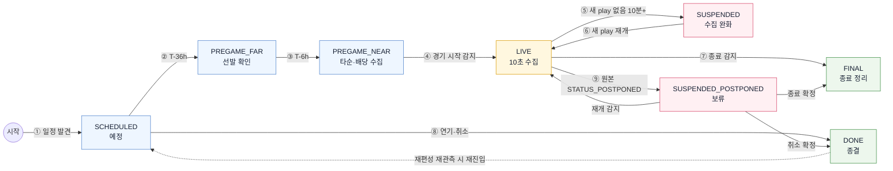
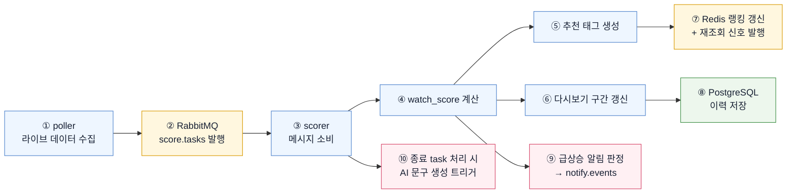
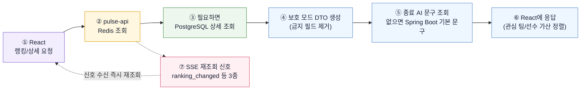

# 데이터 파이프라인

## 1. 경기 상태별 수집 흐름

`PREGAME_FAR`·`PREGAME_NEAR` 같은 이름은 별도 시스템이 아니라 `pulse-poller` 안에서 수집 강도를 정하기 위한 기준이다. ①은 개별 경기의 상태가 아니라 전체 슬레이트를 상시 감시하는 동작이며, 이 감시로 `SCHEDULED` 경기를 발견하고 이후 모든 상태 전이를 감지한다.

### 상태 번호별 의미와 수집

| 번호 | 상태 | poller가 하는 일 | 주기 |
|---|---|---|---|
| ① | 상시 (모든 경기 대상, `SCHEDULED` 포함) | `/games`로 어제·오늘 경기를 확인해 신규 경기, 상태 전이, 연기·취소를 감지한다. 특정 경기의 상태가 아니라 시스템 전체에 라이브 경기가 있는지로 주기가 갈린다. | `/games`: 라이브 경기 1개 이상이면 10초, 0개면 10분 |
| ② | `PREGAME_FAR` (T-36h~T-6h) | 선발 예상 투수 등장을 확인한다. | `/lineups`: 1시간 |
| ③ | `PREGAME_NEAR` (T-6h~시작) | `/lineups`는 타순 확정을, `/odds`는 `pregame_score`의 접전 기대 재료를 모은다. | `/lineups`: 15분 · `/odds`: 30분 |
| ④ | `LIVE` | `/games`는 ①과 같은 사이클로 점수·이닝을 갱신하고, `/plays`는 cursor 증분, `/plate_appearances`는 전체 재조회 후 dedupe한다. 경기별 `/plays`·`/plate_appearances` 호출은 워커 6~8개로 병렬 실행해 한 라운드 지연을 줄인다. 수집 후 RabbitMQ로 계산 요청을 보낸다. LIVE 전이 감지 시 `GAME_START` 알림 이벤트를 발행한다. | `/games`: 10초 · `/plays`: 10초 · `/plate_appearances`: 10초 |
| ⑤ | `SUSPENDED` | 새 play가 없으면 `/plays` 수집만 낮추고, ①의 `/games`로 재개를 감지한다. | `/plays`: 5분 |
| ⑥ | `LIVE` 재개 | 새 play 감지 시 ④의 주기로 복귀한다. | `/plays`: 10초 |
| ⑦ | `FINAL` | 경기 종료를 감지하면 `lifecycleState=FINAL`을 실은 종료 ScoreTask를 발행한다. 열린 다시보기 구간 마감·라이브 랭킹(`score:rank:live`) 제거·`signal:ranking` 발행은 scorer가 수행한다. 별도 재분석은 하지 않는다. | 감지 시 1회 |
| ⑧ | `DONE` | 연기·취소를 감지하면 `lifecycleState=DONE`을 실은 종료 ScoreTask를 발행한다. 랭킹 제거는 scorer가 수행한다. | 감지 시 1회 |
| ⑨ | `SUSPENDED_POSTPONED` | 라이브 중 원본 `STATUS_POSTPONED`(서스펜디드 게임)를 감지하면 `lifecycleState=SUSPENDED_POSTPONED`을 실은 종료 ScoreTask를 발행한다. scorer는 라이브 랭킹에서 제거하되 열린 다시보기 구간은 닫지 않고 보류한다. 이후 재개(`STATUS_IN_PROGRESS`)·종료(`STATUS_FINAL`)·취소(`STATUS_CANCELED`)를 ①의 감시로 받아 각 상태로 보낸다. `DONE`이나 `FINAL`로 바로 보내지 않는 이유: 재개 시 이력이 끊기거나 종료 경기로 잘못 노출되는 것을 막기 위해서다. | 감지 시 1회, 이후 ① 주기 |

**일정 룩어헤드**: ①의 어제·오늘(UTC) 감시와 별도로, 향후 2~3일 일정을 저빈도(6~12시간 주기)로 동기화해 미래 경기와 시작 시각을 미리 확보한다. balldontlie `/games`는 최소 7일 뒤까지 일정을 제공하고, 미래 경기도 `date`에 실제 시작 시각(UTC ISO 8601)을 담는다. 확보한 시작 시각으로 `SCHEDULED → PREGAME_FAR`(T-36h) `→ PREGAME_NEAR`(T-6h) 전이 시점을 예약한다. 시작 시각은 확정 전 변동될 수 있으므로 룩어헤드 동기화마다 갱신하고, 시작 시각 미정(TBD) 경기는 전이 예약을 보류한 뒤 다음 동기화에서 재확인한다.

**연기·취소 재진입**: `DONE`은 연기·취소가 확정된 경기의 종결 상태다. 다만 이후 ①의 상시 감시에서 같은 `game_id`의 원본 상태가 `STATUS_SCHEDULED`·`STATUS_IN_PROGRESS`로 재관측되면(연기 경기 재편성) 해당 상태로 재진입한다. 재진입 시 별도 복구 절차는 없다 — 라이브 랭킹과 현재 상태 캐시는 LIVE 사이클이 재생성하며, 연기·취소 사유는 `games.status` 원본 값이 보존한다.

**경기 전 계산 경로**: poller는 ②·③에서 경기 전 입력이 갱신될 때(선발 확정·변경, 배당 스냅샷 기록, 순위 일 배치 반영, `PREGAME_NEAR` 진입) `lifecycleState=PREGAME`인 ScoreTask를 발행하고, scorer가 DB에 적재된 입력만 읽어 `pregame_score`를 계산·저장한다. 점수 로직과 `scoring.yml` 소유를 scorer 한 곳에 유지하기 위한 배치이며, 외부 API 호출(선발 시즌 스탯 온디맨드 조회 포함)은 poller가 task 발행 전에 끝낸다.

## 2. 호출 예산과 레이트리밋 대응

- **호출 예산(최악 기준)**: 동시 라이브 15경기 시 한 라운드는 `/games` 1회 + `/plays` 15경기 + `/plate_appearances` 15경기 = 31회다. 10초 목표 주기와 실행 여유 시간을 반영하면 분당 약 150회 수준이며, 한도 600 req/min의 약 1/4이다.
- **병렬화 영향**: 경기별 호출 병렬화는 라운드 지연을 줄이는 변경이며 분당 호출 수 자체를 늘리지 않는다. 한도는 분당 창 기준이므로 워커 6~8개 병렬 실행만으로는 별도 버스트 완화가 필요하지 않다.
- **429 대응**: 응답의 `Retry-After`(초)를 그대로 신뢰해 대기하고 해당 사이클을 건너뛴다. 회복 후 우선순위는 `/games` > `/plays` > `/plate_appearances`다(상태 전이 감지 > 증분 수집 > 전체 재조회).
- **일 배치 시각**: `/standings`와 시즌 스탯 캐시는 매일 슬레이트 시작 전 1회(약 10:00 UTC), `/teams`·`/players` 마스터는 일 1회 upsert한다.

## 3. 계산 흐름

### 계산 번호별 설명

| 번호 | 단계 | 설명 |
|---|---|---|
| ① | 라이브 데이터 수집 | `plays`, `plate_appearances`, 현재 경기 상태를 모은다. |
| ② | 계산 요청 발행 | 새 데이터가 들어오면 `ScoreTask`를 RabbitMQ `score.tasks`에 넣는다. 유실 시 해당 시점 이력이 영구 공백이 되므로 브로커로 보낸다. |
| ③ | 메시지 소비 | `pulse-scorer`가 계산할 경기 ID와 시점을 받는다. 처리 실패 메시지는 재전달 후 DLQ로 이동한다. |
| ④ | `watch_score` 계산 | 접전, 후반부, 득점권, 최근 이벤트 같은 랭킹 신호를 점수로 바꾼다. |
| ⑤ | 추천 태그 생성 | 화면에 보여줄 짧은 이유 태그를 만든다. 예: `접전 흐름`, `득점권 압박`, `후반 긴장 구간` |
| ⑥ | 다시보기 구간 갱신 | 일정 점수 이상이면 구간을 열고, 낮아지면 닫는다. |
| ⑦ | Redis 갱신 + 신호 | 실시간 랭킹을 갱신하고 `signal:ranking`·`signal:game:{id}` 채널로 재조회 신호를 발행한다. api가 이를 SSE로 중계한다. |
| ⑧ | PostgreSQL 저장 | 점수 이력, 다시보기 구간, 흥미 순간 이벤트(`game_events`)를 남긴다. 이벤트는 라이브 중 임계 통과 시 추출·영속하며 종료 후 재계산하지 않는다. |
| ⑨ | 급상승 알림 판정 | 히스테리시스(85 진입 발화 / 70 미만 재무장)와 급등 조건(최근 5분 +15 이상)을 통과하면 `notify.events`로 알림 이벤트를 발행한다. 판정이 scorer에 있는 이유: 점수 이력과 히스테리시스 상태를 가진 유일한 곳이기 때문이다. |
| ⑩ | AI 문구 트리거 | 경기 종료 정리 시 `FINAL_HEADLINE`과 마감된 구간의 `REPLAY_SUMMARY`를 스포일러 세이프 `safeContext`와 `contextHash`로 ai-service에 비동기 생성을 요청한다. |

scorer는 `lifecycleState`가 `FINAL`·`DONE`·`SUSPENDED_POSTPONED`인 종료 ScoreTask를 받으면 라이브 계산 대신 종료 정리를 수행한다: 열린 다시보기 구간 마감(`SUSPENDED_POSTPONED`은 보류), `score:rank:live`에서 제거, `signal:ranking` 발행, 종료 문구(`FINAL_HEADLINE`·마감 구간 `REPLAY_SUMMARY`) 생성 트리거. 종료 정리는 경기 상태 전이 기준으로 멱등하며, 이미 정리된 경기의 종료 ScoreTask를 다시 받아도 재실행하지 않는다.

## 4. 사용자 응답 흐름

종료 경기 AI 문구 생성은 응답 경로에 없다. 계산 파이프라인이 종료 정리 시 미리 만들고, API는 PostgreSQL과 읽기 캐시를 조회한다. AI 문구가 아직 없으면 API는 LLM 응답을 기다리지 않고 Spring Boot의 목적별 기본 문구를 즉시 반환한다.

### 응답 번호별 설명

| 번호 | 단계 | 설명 |
|---|---|---|
| ① | 요청 | 프론트는 `pulse-api`만 호출한다. 상세는 현재 모드(`PROTECTED`/`REVEALED`)를 파라미터로 보낸다. |
| ② | Redis 조회 | 라이브 랭킹과 현재 상태 캐시를 빠르게 읽는다. 종료 문구는 PostgreSQL을 기준으로 읽고 필요하면 Redis 읽기 캐시를 사용한다. |
| ③ | 상세 조회 | 경기 상세, 이력, 다시보기 구간은 PostgreSQL에서 읽는다. |
| ④ | 보호 모드 DTO 생성 | 스포일러가 될 수 있는 필드는 서버에서 제거한다. 직렬화 가드 테스트도 같은 금지 필드 목록을 확인한다. |
| ⑤ | 문구 조회 | 종료 경기의 검수를 통과한 AI 문구가 있으면 사용, 없으면 Spring Boot의 목적별 기본 문구를 사용한다. 진행 중·예정 경기는 AI 헤드라인이나 요약을 조회하지 않는다. |
| ⑥ | 화면 응답 | 개인화(관심 팀/선수 가산)는 이 시점에 서버가 적용한다. 공용 랭킹은 하나만 유지한다. |
| ⑦ | SSE 신호 | payload에 데이터를 싣지 않는 재조회 신호만 보낸다. 클라이언트는 신호 수신 즉시 재조회하므로 체감은 푸시와 동일하고, 스포일러 필터링 지점은 REST 한 곳에 유지된다. |
