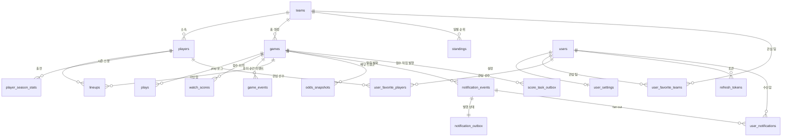

# DB 모델 스키마 설계

## 1. 명명·타입 규칙

| 규칙 | 내용 |
|---|---|
| 명명 | 테이블·컬럼은 `snake_case`. balldontlie 원본 필드명을 최대한 유지한다. |
| 식별자 | balldontlie가 부여한 전역 id(`game_id`, `team_id`, `player_id`, play `order`, lineup id, odds id)를 그대로 PK 또는 자연키로 쓴다. 모두 큰 정수라 `BIGINT`. |
| 시각 | 모든 시각 컬럼은 `TIMESTAMPTZ`(UTC 저장). balldontlie `date`·`updated_at`은 UTC ISO 8601이다. |
| `observed_at` | plays·PA에 **벽시계 타임스탬프가 없으므로** 폴러의 **최초 관측 시각**을 저장해 시간 감쇠(최근 득점·리드 변경)를 계산한다. 정밀도 하한은 폴링 주기(약 20초)다. |
| `backfilled` | 과거 백필로 적재한 행은 `true`. 시간 기반 계산에서 제외한다(백테스트는 order 윈도우로 근사). |
| `source` | 데이터 출처를 `OPERATIONAL`(기본)·`S3_LIVE_ARCHIVE`·`S3_BACKFILL`로 구분한다. S3에서 이전한 데이터를 운영 수집분과 구분하는 컬럼이다. `backfilled`는 `source = 'S3_BACKFILL'`과 동치다. |
| 배열·구조 | 이닝별 점수·신호 기여·태그 등 가변 구조는 `JSONB` 또는 Postgres 배열 타입을 쓴다. |
| 상수 | 가중치·임계값·중요도 배수 자체는 **DB에 저장하지 않는다.** `scoring.yml`에서 관리하고 변경 시 `version`을 올리며, 산출물에는 적용한 version만 추적 메타데이터로 남긴다. |
| 스키마 관리 | 기본 프로파일은 `ddl-auto: none`이고, 로컬 개발은 `local` 프로파일에서만 `ddl-auto: update`를 사용한다. 배포 환경(RDS)은 **Flyway 마이그레이션만** 사용한다. 베이스라인 V1은 DB 이전에 앞서 만들고, 이후 변경은 증분 마이그레이션으로 리뷰를 거친다. |

## 2. 스포일러 보호 규칙

[내부] 표시 컬럼은 **내부 계산 전용**이다. 점수·득점·승패·우세·라이브 배당·결과 텍스트가 여기에 해당한다. 보호 모드 DTO에서 반드시 제거하며 API·프론트로 그대로 내보내지 않는다. 스포일러 보호는 프론트가 아니라 **서버 응답 단계**에서 강제한다. 직렬화 가드 테스트도 같은 금지 필드 목록을 확인한다.

## 3. 전체 관계도 (ERD)



관심 팀은 `user_favorite_teams`, 관심 선수는 `user_favorite_players` 조인 테이블로 관리한다.

## 4. 테이블 개요

| 그룹 | 테이블 | 성격 | 우선순위 |
|---|---|---|---|
| 운영 핵심 | `games` | 최신 스냅샷(upsert) | P0 |
| 운영 핵심 | `plays` | append 로그 | P0 |
| 운영 핵심 | `watch_scores` | append 로그(시계열) | P0 |
| 운영 핵심 | `game_events` | append 로그(확정 결과) | P1 |
| 사용자 | `users` | 계정 | P0 |
| 사용자 | `refresh_tokens` | 토큰 상태 | P0 |
| 사용자 | `user_settings` | 알림·전환 설정 | P0 |
| 사용자 | `user_favorite_teams` | 관심 팀 조인 | P0 |
| 사용자 | `user_favorite_players` | 관심 선수 조인 | P0 |
| 알림 | `notification_events` | 전역 이벤트 원본 | P0 |
| 메시징 | `notification_outbox` | 알림 발행 상태 | P0 |
| 메시징 | `score_task_outbox` | 점수 작업 원본·발행 상태 | P0 |
| 알림 | `user_notifications` | 사용자별 수신함 | P0 |
| 마스터 | `teams` | 정적 마스터 | P1 |
| 마스터 | `players` | 정적 마스터 | P1 |
| 경기 전 입력 | `lineups` | 선발·타순 | P1 |
| 경기 전 입력 | `odds_snapshots` | 시작 직전 스냅샷 | P1 |
| 경기 전 입력 | `standings` | 일 배치 순위 | P1 |
| 경기 전 입력 | `player_season_stats` | 일 배치·캐시 | P2 |

## A. 운영 핵심 테이블

### A-1. `games` — 최신 스냅샷

경기당 1행. `game_id`로 upsert하며 상태·점수·계산 결과의 최신 값만 유지한다.

| 컬럼 | 타입 | 설명 | 제약·비고 |
|---|---|---|---|
| `game_id` | `BIGINT` | balldontlie 경기 id | **PK** |
| `season` | `INT` | 시즌 연도 | |
| `season_type` | `TEXT` | `regular`/postseason 구분 | |
| `postseason` | `BOOLEAN` | 포스트시즌 여부 | 중요도 ×1.15 |
| `start_time` | `TIMESTAMPTZ` | 경기 시작(원본 `date`, UTC) | 생명주기 T-36h/T-6h 기준 |
| `status` | `TEXT` | 원본 상태 `STATUS_*` | 5종(SCHEDULED·IN_PROGRESS·FINAL·POSTPONED·CANCELED) |
| `lifecycle_state` | `TEXT` | 폴러 상태머신 값 | `SCHEDULED`…`DONE` |
| `period` | `SMALLINT` | 현재 이닝 | 후반/연장 신호 |
| `home_team_id` · `away_team_id` | `BIGINT` | 홈/원정팀 | FK → `teams` |
| `home_team_name` · `away_team_name` | `TEXT` | 홈/원정 팀명 | 원본 응답 비정규화, nullable |
| `home_team_abbr` · `away_team_abbr` | `TEXT` | 홈/원정 팀 약자 | 원본 응답 비정규화, nullable |
| `home_runs` · `away_runs` | `SMALLINT` | 팀별 득점 | [내부] 점수 차 신호 |
| `home_hits` · `away_hits` | `SMALLINT` | 팀별 안타 | [내부] |
| `home_errors` · `away_errors` | `SMALLINT` | 팀별 실책 | [내부] |
| `home_inning_scores` · `away_inning_scores` | `JSONB` | 이닝별 득점 배열 | [내부] 초반 난타·빅이닝 검증 |
| `venue` | `TEXT` | 경기장 | 표시용(스포일러 아님) |
| `attendance` | `INT` | 관중 수 | 표시용 |
| `pregame_score` | `SMALLINT` | 예정 정렬 점수 0–100 | [내부] UI 노출 금지 |
| `pregame_inputs` | `JSONB` | `pregame_score` 계산 시점 입력 스냅샷 | [내부] 불변, nullable. 아래 설명 참조 |
| `peak_base_score` | `SMALLINT` | 라이브 중 최고 base_score | [내부] 종료 정렬 키 |
| `final_headline_protected` | `TEXT` | 종료 경기 AI 헤드라인 · 보호 모드용(검수 통과본) | 종료 정리 시 생성 트리거, nullable |
| `final_headline_revealed` | `TEXT` | 종료 경기 AI 헤드라인 · 공개 모드용(검수 통과본, 최종 결과 반영 가능) | 종료 정리 시 생성 트리거, nullable |
| `final_headline_revealed_regeneration_attempted_at` | `TIMESTAMPTZ` | 공개 헤드라인 자동 재생성(경기당 1회) 시도 시각 | 재시작과 무관한 중복 호출 방지, nullable |
| `finalized_at` · `terminal_done_at` · `terminal_suspended_postponed_at` | `TIMESTAMPTZ` | 종료 정리·종결·보류 처리 완료 시각 | 종료 task 멱등 처리 근거, nullable |
| `last_play_order` | `BIGINT` | `/plays` 증분 커서(마지막 order) | |
| `last_polled_at` | `TIMESTAMPTZ` | 최근 폴링 시각 | |
| `observed_at` | `TIMESTAMPTZ` | 최신 상태 관측 시각 | |
| `source` | `TEXT` | 데이터 출처 | 기본 `OPERATIONAL` |
| `created_at` · `updated_at` | `TIMESTAMPTZ` | 생성/수정 시각 | |

**키·인덱스** — PK `game_id` · idx(`lifecycle_state`), idx(`start_time`), idx(`status`)

> `pregame_inputs`는 `pregame_score`를 계산할 때마다 사용한 입력을 통째로 담아 덮어쓴다: 양 팀 승률, 사용한 배당 스냅샷 타입(`FIRST_SEEN`/`PREGAME_FINAL`/폴백)과 벤더 중앙값 암시 승률, 선발 투수 id·시즌 ERA, 경쟁권 판정, 결측·폴백 사유, `scoring.yml` 버전, 계산 시각. 시즌 스탯·순위가 최신값으로 덮어써져도 "그 점수가 왜 나왔는지"를 시점 그대로 복원하기 위한 추적용 스냅샷이며, 재계산 입력으로는 사용하지 않는다.

### A-2. `plays` — play 이벤트 append 로그

`/plays`를 order 커서로 증분 수집해 새 play만 추가한다. 라이브 신호와 공개 모드 `경기 흐름`의 최근 플레이 원천이다.

| 컬럼 | 타입 | 설명 | 제약·비고 |
|---|---|---|---|
| `id` | `BIGSERIAL` | 대리 PK | **PK** |
| `game_id` | `BIGINT` | 경기 | FK → `games` |
| `play_order` | `BIGINT` | 경기 내 순서(원본 `order`) | 증분 커서 |
| `type` | `TEXT` | 이벤트 타입 | 이닝 경계 감지 |
| `inning` | `SMALLINT` | 이닝 번호 | |
| `inning_type` | `TEXT` | `Top`/`Bottom`/`Mid` | |
| `text` | `TEXT` | play 설명 | [내부] 스포일러 검수 게이트 필요 |
| `text_ko` | `TEXT` | 공개 최근 플레이용 한국어 번역 | nullable. LLM 결과를 화면에서 그대로 표시 |
| `text_ko_context_hash` | `TEXT` | 번역 원문·목적 context hash | nullable. 원문과 해시가 일치할 때만 갱신 |
| `text_ko_attempts` | `INTEGER` | 번역 시도 횟수 | 기본 0. 실패·반려의 무한 재호출 제한 |
| `home_score` · `away_score` | `SMALLINT` | play 후 점수 | [내부] 리드 변경 감지 |
| `scoring_play` | `BOOLEAN` | 득점 play 여부 | 최근 득점·빅이닝 |
| `score_value` | `SMALLINT` | 득점 수(1–3, 그 외 null) | |
| `outs` · `balls` · `strikes` | `SMALLINT` | 카운트 | 카운트/아웃 신호 |
| `batter_id` · `pitcher_id` | `BIGINT` | 타자/투수 | FK → `players`(nullable) |
| `pitch_type` | `TEXT` | 구종 | |
| `pitch_velocity` | `SMALLINT` | 구속(mph) | |
| `hit_coordinate_x` · `hit_coordinate_y` | `SMALLINT` | 타구 좌표 | 시각화(후순위) |
| `trajectory` | `TEXT` | 궤적 `F`/`P`/`G`/null | |
| `runner_on_first` · `runner_on_second` · `runner_on_third` | `BOOLEAN` | 타석 시작 시 주자 상태(PA `runner_on_*` 유래) | 압박·득점권 신호. PA 미대응 play는 null |
| `observed_at` | `TIMESTAMPTZ` | 최초 관측 시각 | 시간 감쇠 기준 |
| `backfilled` | `BOOLEAN` | 백필 여부 | 기본 `false` |
| `source` | `TEXT` | 데이터 출처 | 기본 `OPERATIONAL` |

**키·인덱스** — PK `id` · **UNIQUE(`game_id`, `play_order`)** · idx(`game_id`, `play_order`)

> `text_ko`·`text_ko_context_hash`는 신규 Flyway 마이그레이션으로 추가한다. 적용 이력을 보존하기 위해 기존 baseline 파일은 수정하지 않는다.

> `runner_on_*` 채움 규칙: poller가 PA를 `pa_number` 오름차순으로 소비하며 plays의 타석 경계 play에 순차 대응시키고, (`inning`, `half_inning`, `batter_id`) 일치로 검증한다. 검증 불일치·매핑 모호(재관측 순서 꼬임 등) 시 해당 타석은 `null`로 남긴다. 같은 이닝에 동일 타자가 다시 나오는 경우(batting around)에도 `pa_number` 순차 소비로 같은 결과를 보장한다.

### A-3. `watch_scores` — 점수 이력 append 로그

라이브 폴링 사이클마다 1행. 시계열이라 시각별 점수 추이와 신호 기여를 남긴다.

| 컬럼 | 타입 | 설명 | 제약·비고 |
|---|---|---|---|
| `id` | `BIGSERIAL` | PK | **PK** |
| `game_id` | `BIGINT` | 경기 | FK → `games` |
| `computed_at` | `TIMESTAMPTZ` | 계산 시각(폴링 사이클 observed_at) | |
| `play_order` | `BIGINT` | 계산 기준 마지막 play order | |
| `inning` · `inning_type` | `SMALLINT` · `TEXT` | 계산 시점 이닝 | |
| `base_score` | `SMALLINT` | 8개 신호 합(보정 전) | [내부] |
| `importance_multiplier` | `NUMERIC(4,2)` | 경기 중요도 배수 ×0.90–×1.15 | [내부] |
| `pregame_bonus` | `NUMERIC(4,2)` | 사전 가산 `pregame_score/10`(0–10) | [내부] |
| `watch_score` | `SMALLINT` | 최종 `clamp(raw, 0, 100)` | [내부] 랭킹 정렬 키 |
| `scoring_version` | `INT` | 계산에 적용한 `scoring.yml` version | 기존 행은 `null`, 신규 저장분부터 기록 |
| `signal_contributions` | `JSONB` | 신호별 기여 맵 | [내부] 예: `{"후반연장":20,"점수차":15}` |
| `tags` | `TEXT[]` | 추천 이유 태그 | 예: `접전 흐름`, `득점권 압박`, `후반 긴장 구간` |
| `backfilled` | `BOOLEAN` | 백필 여부 | 기본 `false` |
| `source` | `TEXT` | 데이터 출처 | 기본 `OPERATIONAL` |

**키·인덱스** — PK `id` · **UNIQUE(`game_id`, `computed_at`)** (`score.tasks` 재전달 멱등 키) · idx(`game_id`, `computed_at`)

> `base_score`의 8개 신호 = 후반/연장 · 점수 차 · 최근 득점 · 리드 변경 · 빅이닝 · 압박 · 카운트/아웃 · 초반 난타. **관심 팀/선수 가산(최대 +15)은 저장하지 않고** Redis 공용 랭킹을 읽은 뒤 API 응답 조립 시점에 사용자별로 더한다. 압박 신호는 `plate_appearances`에서 산출하되 기여값만 이 테이블에 남는다.

> `scoring_version`은 가중치 설정 전체를 복제하는 컬럼이 아니라, 해당 시계열이 어떤 설정 스냅샷으로 계산됐는지 연결하는 추적 키다. 기존 행은 정확한 버전을 역산할 수 없어 `null`로 유지한다.

### A-4. `game_events` — 흥미로운 순간 이벤트(확정 결과)

scorer가 라이브 계산 중 임계를 통과한 순간을 추출해 append하는 해석 계층이다. 보호 모드 `경기 흐름`의 원천이며, 라이브 1회 계산 결과를 종료 후 그대로 재사용한다. 공개 모드의 `경기 흐름`은 이 테이블이 아니라 `plays`를 사용한다. PA 유래 이벤트는 원본이 DB에 없으므로 이 테이블이 유일한 조회 저장소다. 원본 소급 재추출은 S3 아카이브를 사용한다.

| 컬럼 | 타입 | 설명 | 제약·비고 |
|---|---|---|---|
| `id` | `BIGSERIAL` | PK | **PK** |
| `game_id` | `BIGINT` | 경기 | FK → `games` |
| `event_type` | `TEXT` | 이벤트 종류 | |
| `spoiler_level` | `TEXT` | `PROTECTED_SAFE`/`REVEALED_ONLY` | 미분류·알 수 없는 값은 **노출 차단**(기본 차단) |
| `source_type` · `source_ref` | `TEXT` · `BIGINT` | 원천 행: `PLAY`+`play_order` / `PA`+`pa_number` | dedupe 키 구성 |
| `inning` | `SMALLINT` | 이닝 숫자 | 보호 모드 노출 가능 |
| `inning_type` | `TEXT` | 초/말 | [내부] 보호 DTO에서 제거 |
| `batter_id` · `pitcher_id` | `BIGINT` | 관련 선수 | FK → `players`, nullable. 이벤트 판정 추적용 |
| `payload` | `JSONB` | 근거 수치(투구 수·구속 추이·exit_velocity 등) | [내부] 이벤트 판정 추적용 |
| `is_timeline_highlight` | `BOOLEAN` | 보호 타임라인 하이라이트 표시 | 기본 `false`. 추천 점수 급변 순간의 anchor 이벤트만 `true`. 보호 타임라인은 이 값이 `true`인 행만 노출 |
| `copy_protected` | `TEXT` | 이벤트 AI 문구 · 보호 모드용(검수 통과본) | nullable. `copy_protected_context_hash` 일치 시에만 갱신 |
| `copy_revealed` | `TEXT` | 기존 공개 이벤트 AI 문구 | **폐기 예정**. 신규 생성·조회 금지 |
| `copy_protected_context_hash` | `TEXT` | 보호 모드 문구 생성 컨텍스트 해시 | nullable. 모드별 컨텍스트가 달라 해시를 분리 저장 |
| `copy_protected_attempts` · `copy_revealed_attempts` | `INTEGER` | 문구 생성 시도 횟수 | 기본 0. 재시도 상한 판단용 |
| `copy_revealed_context_hash` | `TEXT` | 기존 공개 문구 생성 컨텍스트 해시 | **폐기 예정**. `copy_revealed` 제거 전까지만 보존 |
| `ruleset_version` | `TEXT` | 추출 룰 버전(`scoring.yml` version) | |
| `observed_at` | `TIMESTAMPTZ` | 최초 관측 시각 | 타임라인 공통 정렬 키 |
| `backfilled` | `BOOLEAN` | 백필 여부 | 기본 `false` |
| `source` | `TEXT` | 데이터 출처 | 기본 `OPERATIONAL` |

**키·인덱스** — PK `id` · **UNIQUE(`game_id`, `event_type`, `source_type`, `source_ref`)** (재관측 dedupe) · idx(`game_id`, `observed_at`) · idx(`game_id`, `is_timeline_highlight`, `observed_at`)

> `copy_revealed`·`copy_revealed_context_hash`는 공개 `경기 흐름` 전환 후 사용 여부를 확인한 다음 별도 Flyway 마이그레이션으로 제거한다. 제거 전에도 신규 쓰기와 API 조회에는 사용하지 않는다.

> 발생 임계와 경기당 상한(예: `hard_contact` 타석당 1회·경기당 8회)은 `scoring.yml`에서 관리한다. `plays` 유래 이벤트(득점·리드 변경·홈런·빅이닝)는 원본에서 재파생 가능하지만 상세 API가 이 테이블 하나만 읽도록 함께 저장한다.

## B. 사용자·알림 테이블

### B-1. `users` — 계정

| 컬럼 | 타입 | 설명 | 제약·비고 |
|---|---|---|---|
| `user_id` | `BIGSERIAL` | 사용자 id | **PK** |
| `email` | `TEXT` | 로그인 이메일 | UNIQUE |
| `password_hash` | `TEXT` | BCrypt 해시 | 평문·복호화 가능 형태 저장 금지 |
| `role` | `TEXT` | 권한(`USER`/`ADMIN`) | 기본 `USER` |
| `status` | `TEXT` | 상태(`ACTIVE`/`WITHDRAWN`/`SUSPENDED`) | 기본 `ACTIVE` |
| `last_login_at` | `TIMESTAMPTZ` | 최근 로그인 시각 | nullable |
| `deleted_at` | `TIMESTAMPTZ` | 탈퇴 시각(soft delete) | nullable |
| `created_at` · `updated_at` | `TIMESTAMPTZ` | 생성/수정 | |

**키·인덱스** — PK `user_id` · UNIQUE(`email`)

### B-2. `refresh_tokens` — 리프레시 토큰 상태

리프레시 토큰은 폐기·회전·재사용 감지라는 상태를 가진 보안 데이터라 DB 행으로 관리한다. 정리 배치는 `expires_at`이 지난 행만 삭제한다 — 폐기(`revoked_at`) 행도 만료 전에는 재사용 감지 근거로 보존한다.

| 컬럼 | 타입 | 설명 | 제약·비고 |
|---|---|---|---|
| `refresh_token_id` | `BIGSERIAL` | PK | **PK** |
| `user_id` | `BIGINT` | 사용자 | FK → `users.user_id` |
| `token_hash` | `TEXT` | 토큰 해시 | 원문 저장 금지 · UNIQUE |
| `status` | `TEXT` | 토큰 상태(`ACTIVE`/`REVOKED`/`REUSED`) | 기본 `ACTIVE` |
| `expires_at` | `TIMESTAMPTZ` | 만료 시각 | |
| `revoked_at` | `TIMESTAMPTZ` | 폐기 시각 | 회전·로그아웃 시 기록, nullable |
| `created_at` · `last_used_at` | `TIMESTAMPTZ` | 생성/최근 사용 | |

**키·인덱스** — PK `refresh_token_id` · UNIQUE(`token_hash`) · idx(`user_id`)

### B-3. `user_settings` — 사용자 설정

| 컬럼 | 타입 | 설명 | 제약·비고 |
|---|---|---|---|
| `user_id` | `BIGINT` | 사용자 id | **PK** · FK → `users` |
| `notify_game_start` | `BOOLEAN` | 관심 팀 경기 시작 알림 | 기본 `true` |
| `notify_surge_enabled` | `BOOLEAN` | 급상승 경기 알림 | 기본 `true` |
| `recommend_switch_enabled` | `BOOLEAN` | 경기 전환 추천 | 기본 `true` |
| `created_at` · `updated_at` | `TIMESTAMPTZ` | 생성/수정 | |

**키·인덱스** — PK `user_id`

> 알림 임계(85)·재무장(70)·급등 조건은 사용자별 설정이 아니라 `scoring.yml` 전역 상수다. 기본 스포일러 모드 설정은 두지 않는다 — 모든 경기는 항상 보호 모드로 시작하고, 경기 단위 공개 상태는 서버에 저장하지 않고 클라이언트(localStorage)에만 둔다.

### B-4. `user_favorite_teams` — 관심 팀

| 컬럼 | 타입 | 설명 | 제약·비고 |
|---|---|---|---|
| `user_id` | `BIGINT` | 사용자 id | FK → `users.user_id` |
| `team_id` | `BIGINT` | 관심 팀 id | FK → `teams.team_id` |
| `created_at` | `TIMESTAMPTZ` | 등록 시각 | |

**키·인덱스** — PK(`user_id`, `team_id`) · idx(`team_id`)

### B-5. `user_favorite_players` — 관심 선수

| 컬럼 | 타입 | 설명 | 제약·비고 |
|---|---|---|---|
| `user_id` | `BIGINT` | 사용자 id | FK → `users.user_id` |
| `player_id` | `BIGINT` | 관심 선수 id | FK → `players.player_id` |
| `created_at` | `TIMESTAMPTZ` | 등록 시각 | |

**키·인덱스** — PK(`user_id`, `player_id`) · idx(`player_id`)

### B-6. `notification_events` — 알림 이벤트 원본 (전역 1행)

scorer(급상승)·poller(경기 시작)가 판정해 발행한 이벤트의 원본. 사용자별 수신함과 분리해 발화 이력을 남긴다.

| 컬럼 | 타입 | 설명 | 제약·비고 |
|---|---|---|---|
| `event_id` | `UUID` | 이벤트 id | **PK** · 발행 측 생성(멱등 키) |
| `type` | `TEXT` | `SURGE`/`GAME_START` | |
| `game_id` | `BIGINT` | 경기 | FK → `games` |
| `tags` | `TEXT[]` | 발화 시점 태그 | 문구 소재(점수 숫자 저장 금지) |
| `occurred_at` | `TIMESTAMPTZ` | 발화 시각 | |

**키·인덱스** — PK `event_id` · idx(`game_id`, `occurred_at`)

### B-7. `notification_outbox` — 알림 발행 대기열

`notification_events`와 같은 트랜잭션에서 생성한다. RabbitMQ 발행 실패 시 재시도 상태를 보존하며, 발행 성공 후에도 운영 추적을 위해 행을 유지한다.

| 컬럼 | 타입 | 설명 | 제약·비고 |
|---|---|---|---|
| `outbox_id` | `UUID` | outbox id | **PK** |
| `event_id` | `UUID` | 원본 이벤트 | **UNIQUE** · FK → `notification_events` |
| `event_type` | `VARCHAR(30)` | 이벤트 타입 | `SURGE`/`GAME_START` |
| `game_id` | `BIGINT` | 경기 id | 메시지 재구성 값 |
| `message` · `latest_tag` | `TEXT` | 알림 문구·최신 태그 | `latest_tag` nullable |
| `occurred_at` | `TIMESTAMPTZ` | 이벤트 발생 시각 | 메시지 재구성 값 |
| `status` | `VARCHAR(20)` | `PENDING`/`PUBLISHED` | |
| `attempt_count` | `INTEGER` | 실패 횟수 | 기본값 0 |
| `next_attempt_at` | `TIMESTAMPTZ` | 다음 발행 시각 | PENDING 조회 기준 |
| `created_at` · `published_at` | `TIMESTAMPTZ` | 생성·발행 완료 시각 | `published_at` nullable |
| `last_error` | `TEXT` | 최근 실패 내용 | nullable |

**키·인덱스** — PK `outbox_id` · UNIQUE(`event_id`) · partial idx(`next_attempt_at`, `created_at`) WHERE `status='PENDING'`

### B-8. `score_task_outbox` — 점수 계산 작업 발행 대기열

`ScoreTask` 원본 payload와 발행 상태를 한 트랜잭션에서 생성한다. RabbitMQ 발행 실패 시 동일 `observed_at` 작업을 보존·재시도하며, 발행 성공 후에도 운영 추적을 위해 행을 유지한다.

| 컬럼 | 타입 | 설명 | 제약·비고 |
|---|---|---|---|
| `outbox_id` | `UUID` | outbox id | **PK** |
| `game_id` | `BIGINT` | 경기 id | FK → `games` |
| `observed_at` | `TIMESTAMPTZ` | 폴링 사이클 시각 | 소비 측 `computed_at` 멱등 키 |
| `payload` | `JSONB` | 원본 `ScoreTask` | 상황·PA 스냅샷 포함 |
| `status` | `VARCHAR(20)` | `PENDING`/`PUBLISHED` | |
| `attempt_count` | `INTEGER` | 실패 횟수 | 기본값 0 |
| `next_attempt_at` | `TIMESTAMPTZ` | 다음 발행 시각 | PENDING 조회 기준 |
| `created_at` · `published_at` | `TIMESTAMPTZ` | 생성·발행 완료 시각 | `published_at` nullable |
| `last_error` | `TEXT` | 최근 실패 내용 | nullable |

**키·인덱스** — PK `outbox_id` · UNIQUE(`game_id`, `observed_at`) · partial idx(`next_attempt_at`, `created_at`) WHERE `status='PENDING'`

### B-9. `user_notifications` — 사용자별 수신함

api의 notification 소비자가 설정 켠 사용자에게 fan-out해 저장한다. 알림 센터의 최신순 목록·미읽음 배지·읽음 처리·7일 보관을 지원한다.

| 컬럼 | 타입 | 설명 | 제약·비고 |
|---|---|---|---|
| `id` | `BIGSERIAL` | PK | **PK** |
| `event_id` | `UUID` | 원본 이벤트 | FK → `notification_events` |
| `user_id` | `BIGINT` | 수신자 | FK → `users` |
| `message` | `TEXT` | 보호 문구(검수 통과본) | 점수·결과 표현 금지 |
| `read_at` | `TIMESTAMPTZ` | 읽음 시각 | nullable = 미읽음 |
| `created_at` | `TIMESTAMPTZ` | 저장 시각 | 7일 경과 행은 배치 삭제 |

**키·인덱스** — PK `id` · **UNIQUE(`event_id`, `user_id`)** (중복 전달 멱등 처리) · idx(`user_id`, `created_at` DESC)

## C. 마스터 데이터

### C-1. `teams`

| 컬럼 | 타입 | 설명 | 제약·비고 |
|---|---|---|---|
| `team_id` | `BIGINT` | balldontlie 팀 id | **PK** |
| `logo_team_id` | `BIGINT` | 로고 매핑용 팀 id | nullable |
| `abbreviation` | `TEXT` | 약칭(예: `CHC`) | |
| `display_name` | `TEXT` | 표시명(예: `Chicago Cubs`) | |
| `short_display_name` · `name` · `location` | `TEXT` | 짧은 표시명·팀명·연고 | |
| `slug` | `TEXT` | 슬러그 | |
| `league` · `division` | `TEXT` | 리그(AL/NL)·디비전 | 그룹핑 |
| `created_at` · `updated_at` | `TIMESTAMPTZ` | 생성/수정 | |

**키·인덱스** — PK `team_id`

### C-2. `players`

| 컬럼 | 타입 | 설명 | 제약·비고 |
|---|---|---|---|
| `player_id` | `BIGINT` | balldontlie 선수 id | **PK** |
| `full_name` | `TEXT` | 전체 이름 | `search`로 관심 선수 검색 |
| `first_name` · `last_name` | `TEXT` | 이름/성 | |
| `position` | `TEXT` | 기본 포지션 | |
| `team_id` | `BIGINT` | 소속팀 | FK → `teams`(nullable) |
| `jersey` | `TEXT` | 등번호 | |
| `bats_throws` | `TEXT` | 타격/투구 손 | |
| `dob` | `DATE` | 생년월일 | |
| `debut_year` | `INT` | 데뷔 연도 | |
| `active` | `BOOLEAN` | 현역 여부 | |
| `created_at` · `updated_at` | `TIMESTAMPTZ` | 생성/수정 | |

**키·인덱스** — PK `player_id` · idx(`team_id`), idx(`full_name`)

> 시딩 원천은 poller 파이프라인(추적 경기의 스텁·보강)과 관심 선수 등록(§API_CONTRACTS 1.3)이다. 후자로 추적 경기에 없던 선수도 행으로 존재할 수 있다. 관심 선수 등록 행은 `full_name`이 채워져 있어 `full_name IS NULL` 대상 보강 배치의 갱신 범위 밖이다.

## D. 경기 전 계산 입력

> 이 그룹은 `pregame_score`와 경기 중요도 보정의 입력이다. 대부분 저빈도(일 배치·경기 전)로 갱신되며, `odds_snapshots`를 제외하면 파생 점수는 `games.pregame_score`에 반영된 뒤에는 상세 표시·재계산 용도로만 쓴다.

### D-1. `lineups` — 라인업·선발

| 컬럼 | 타입 | 설명 | 제약·비고 |
|---|---|---|---|
| `lineup_item_id` | `BIGINT` | balldontlie lineup id | **PK** |
| `game_id` | `BIGINT` | 경기 | FK → `games` |
| `player_id` | `BIGINT` | 선수 | FK → `players` |
| `team_id` | `BIGINT` | 팀 | FK → `teams` |
| `batting_order` | `SMALLINT` | 타순 1–9 (공개 전 `null`) | 타순 확정 감지 |
| `position` | `TEXT` | 이 경기 포지션 | |
| `is_probable_pitcher` | `BOOLEAN` | 선발 예상 투수 여부 | pregame 선발 매치업 입력 |
| `observed_at` | `TIMESTAMPTZ` | 관측 시각 | 타순 공개 시점 실측용 |
| `source` | `TEXT` | 데이터 출처 | 기본 `OPERATIONAL` |

**키·인덱스** — PK `lineup_item_id` · UNIQUE(`game_id`, `player_id`) · idx(`game_id`)

### D-2. `odds_snapshots` — 경기 전 배당 스냅샷

[내부] 내부 전용, UI 노출 금지. **라이브 배당은 저장하지 않는다**(스포일러·갱신 지연). 오프닝 배당은 2026 시즌 미제공이므로, 당일 첫 관측(`FIRST_SEEN`)과 시작 직전(`PREGAME_FINAL`) 스냅샷만 남겨 접전 기대를 고정한다.

**기록 조건**: 두 스냅샷 모두 `observed_at < start_time`이고 경기 상태가 시작 전일 때만 기록·갱신한다. `/odds`는 경기 중에도 같은 행이 라이브 라인으로 계속 덮어써지므로, **LIVE 전환 이후 관측값으로는 스냅샷을 생성·갱신하지 않는다**. 시작 전 스냅샷이 없으면 `pregame_score`의 접전 기대는 승률 차 폴백을 쓴다. `FIRST_SEEN`은 당일 첫 관측 시 1회만 기록하고, `PREGAME_FINAL`은 시작 전 관측마다 같은 행을 upsert해 "시작 전 마지막 관측"을 유지한다.

| 컬럼 | 타입 | 설명 | 제약·비고 |
|---|---|---|---|
| `id` | `BIGSERIAL` | PK | **PK** |
| `game_id` | `BIGINT` | 경기 | FK → `games` |
| `vendor` | `TEXT` | sportsbook(6곳) | 벤더 중앙값으로 노이즈 제거 |
| `snapshot_type` | `TEXT` | `FIRST_SEEN`/`PREGAME_FINAL` | |
| `moneyline_home_odds` · `moneyline_away_odds` | `INT` | 승리 배당(American) | [내부] 접전 기대 산출 |
| `spread_home_value` · `spread_away_value` | `NUMERIC(3,1)` | 런라인 | |
| `spread_home_odds` · `spread_away_odds` | `INT` | 런라인 배당 | |
| `total_value` | `NUMERIC(3,1)` | 총점 기준선 | 난타전/투수전 예상 보조 |
| `total_over_odds` · `total_under_odds` | `INT` | 오버/언더 배당 | |
| `vendor_updated_at` | `TIMESTAMPTZ` | 원본 `updated_at` | 신선도 판단 |
| `observed_at` | `TIMESTAMPTZ` | 스냅샷 저장 시각 | |
| `source` | `TEXT` | 데이터 출처 | 기본 `OPERATIONAL` |

**키·인덱스** — PK `id` · UNIQUE(`game_id`, `vendor`, `snapshot_type`)

### D-3. `standings` — 일 배치 순위

| 컬럼 | 타입 | 설명 | 제약·비고 |
|---|---|---|---|
| `id` | `BIGSERIAL` | PK | **PK** |
| `season` | `INT` | 시즌 | |
| `snapshot_date` | `DATE` | 배치 날짜 | |
| `team_id` | `BIGINT` | 팀 | FK → `teams` |
| `league_name` · `division_name` | `TEXT` | 리그·디비전 | |
| `wins` · `losses` | `SMALLINT` | 승/패 | |
| `win_percent` | `NUMERIC(4,3)` | 승률 | 접전 기대 폴백 |
| `games_behind` | `NUMERIC(4,1)` | 게임차 | |
| `playoff_percent` | `NUMERIC(5,2)` | PS 진출 확률 | 경쟁권(10–90%) 판정 |
| `wildcard_percent` | `NUMERIC(5,2)` | 와일드카드 확률 | |
| `streak` | `SMALLINT` | 연승/연패(음수) | 참고용 |
| `last_ten_games` | `TEXT` | 최근 10경기 전적 `승-패`(예: `5-5`) | 참고용, 원문 문자열 |
| `observed_at` | `TIMESTAMPTZ` | 관측 시각 | |
| `source` | `TEXT` | 데이터 출처 | 기본 `OPERATIONAL` |

**키·인덱스** — PK `id` · UNIQUE(`season`, `snapshot_date`, `team_id`)

### D-4. `player_season_stats` — 선수 시즌 누적(일 배치·캐시)

| 컬럼 | 타입 | 설명 | 제약·비고 |
|---|---|---|---|
| `season` · `player_id` | `INT` · `BIGINT` | 시즌·선수 | **복합 PK**, `player_id` FK → `players` |
| `pitching_era` | `NUMERIC(4,2)` | 시즌 ERA | 선발 매치업 핵심 |
| `pitching_war` · `pitching_whip` · `pitching_k_per_9` | `NUMERIC(4,2)` | 투구 WAR·WHIP·K/9 | 매치업 강도 보조 |
| `batting_war` | `NUMERIC(4,2)` | 타격 WAR | 스타 선수 판정 |
| `batting_ops` · `batting_hr` | `NUMERIC(4,3)` · `SMALLINT` | OPS·홈런 | 선수 카드 표시 |
| `updated_at` | `TIMESTAMPTZ` | 갱신 시각 | |

**키·인덱스** — PK(`season`, `player_id`) · `fielding_fip`는 실측 스케일 이상으로 **적재하지 않는다.**

선발 매치업 입력은 pregame 계산 시점에 확정 선발 예상 투수(`is_probable_pitcher`)의 `player_ids[]`로 `/season_stats`를 온디맨드 조회하거나 일 배치로 이 테이블에 캐시한다(P2). 별도 P1 승격은 하지 않는다. 조회 실패 시 직전 캐시값을 사용하고, 선발 미확정 시 해당 선발 매치업은 0점 처리한다.


## E. 부록

### E-1. `plate_appearances`를 코어 테이블로 두지 않는 이유

`/plate_appearances`는 압박(`runner_on_*`), 강한 타구(`exit_velocity`·`is_barrel`, 임계는 `scoring.yml`), 긴 타석, 투수 흔들림(`release_speed`·`pitcher_pitch_count`) 등 **상세 신호 산출에만 소비**한다. 원본은 S3 아카이브에 남고 산출 결과는 용도별로 영속되므로, 운영 Postgres 코어 테이블로 두지 않는다.

- 라이브 압박·카운트 신호: poller가 `/plate_appearances`(`runner_on_*`)·`/plays`(카운트)에서 추출해 `ScoreTask.situation`으로 scorer에 전달한다.
- 백테스트 재계산: 타석 시작 시 주자 상태는 `plays.runner_on_*` 3컬럼으로 영속해 압박 주자 신호를 재계산할 수 있게 한다. `plays.runner_on_*`는 전 타석의 원본 상태(사실)이고 `game_events`의 압박 이벤트는 임계 통과분(해석)이므로 서로 대체하지 않는다.
- 상세 화면 노출: 임계를 통과한 순간(긴 승부·강한 타구·투수 흔들림 등)은 scorer가 라이브 중 `game_events`로 추출·영속한다.
- 그 외 PA 필드 원본: S3 아카이브에만 남는다. 운영 이전 후에도 PA 아카이빙은 유지하므로 추출 룰 변경 시 소급 재추출이 가능하다.


### E-2. Redis 키 (실시간 조회 전용)

핵심 키만 요약한다.

| 키 | 타입 | 내용 |
|---|---|---|
| `score:rank:live` | `ZSET` | 진행 중 경기 `watch_score` 랭킹 (member=`game_id`, score=`watch_score`) |
| `game:{id}:live` | `HASH` | 현재 점수·이닝·노출 태그 캐시 (내부 전용) |

종료 경기 AI 헤드라인은 Redis 캐시 없이 `games.final_headline_protected`·`games.final_headline_revealed`를 직접 조회한다.

### E-3. S3 원본 레이아웃 (개발·백테스트 전용)

운영 DB가 아니라 개발·백테스트용 원본 아카이브다.

```text
raw/games/dt=YYYY-MM-DD/games_HHMMSSZ.json.gz
raw/plays/game_id=<id>/plays_YYYY-MM-DD_HHMMSSZ_c<cursor>.json.gz
```

각 객체는 `observed_at`, `endpoint`, `params`, `response`를 가진 gzip JSON이다. `backfilled: true` 객체는 시간 감쇠 계산에서 제외한다.

이전 완료 후 raw-archive 도구의 수집은 중단하고 수집분은 운영 DB로 이전해 보존한다. 단 **`/plate_appearances` 원본은 예외**로, 운영 poller가 수신한 응답을 같은 레이아웃으로 S3에 계속 업로드한다. PA는 DB에 영속하지 않는 유일한 원본이므로 이 아카이브가 `game_events` 추출 룰 변경 시 소급 재추출과 PA 신호 백테스트 확장의 자체 보존 수단이다.

## F. 이전 데이터 구분과 정합성

S3에서 운영 DB로 이전한 데이터를 운영 수집분과 구분하고, 불가피한 차이를 명시한다.

### F-1. 구분 방법

- `source` 컬럼: `games`·`plays`·`watch_scores`·`game_events`·`odds_snapshots`·`standings`·`lineups` 등 이전 이력을 담는 테이블에 둔다. 값은 `OPERATIONAL`(운영 poller 수집, 기본), `S3_LIVE_ARCHIVE`(S3 라이브 아카이브 이전분), `S3_BACKFILL`(과거 시즌 백필 이전분)이다.
- `backfilled` 불리언은 `source = 'S3_BACKFILL'`과 동치이며, 기존 시간 감쇠 제외 로직이 계속 참조한다.
- 이전 경계(cutover): 운영 poller 가동 시각을 이전 경계로 기록·문서화한다. 경계 이전 관측·이전분은 `source`가 `OPERATIONAL`이 아니다.

### F-2. 운영 수집분과의 차이

이 표기(`source ≠ OPERATIONAL`)의 데이터는 운영 수집분과 다음이 다르다. 변환 시 운영 스키마에 최대한 정합하게 맞추고, 불가피한 결측은 `null`로 두고 `source`로 식별한다.

| 항목 | 차이 |
|---|---|
| `observed_at` 정밀도 | `S3_LIVE_ARCHIVE`의 관측 주기가 운영(약 20초)과 다를 수 있어 시간 감쇠(최근 득점·리드 변경) 오차 상한이 커진다. `S3_BACKFILL`은 벽시계 시각이 없어 order 윈도우로 근사한다. |
| 압박 신호 | 주자 상태는 이전 스크립트가 S3 PA 원본에서 `plays.runner_on_*`로 매핑해 압박 주자 신호는 재계산할 수 있다. 그 외 PA 기반 신호(강한 타구·구속 저하·긴 타석)는 `watch_scores.signal_contributions`의 기여값만 보존되고 재계산할 수 없다. |
| `watch_scores` | 이전분은 이전 시점 `scoring.yml` 버전으로 재생한 값이다. 백테스트에서는 기준(baseline) 참고용으로만 쓰고, 가중치 재계산 시 새로 산출한다. |
| 선수 시즌 스탯 | `player_season_stats`는 최신값을 덮어써 과거 경기 시점 ERA를 복원할 수 없다. 이전 데이터의 `pregame_score` 선발 매치업 재계산은 제한된다. |
| 수집 주기·결측 | 라이브 아카이브·백필의 수집 주기가 운영 계획과 다를 수 있고, 일부 필드가 결측일 수 있다. 결측은 `null`로 두고 `source`로 구분한다. |
