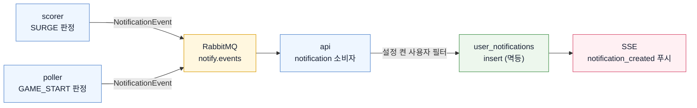

# 알림 설계

알림은 경기 단위로만 보낸다. 개별 홈런, 득점, 역전, 삼진 같은 이벤트 알림은 사용하지 않는다. 알림·토스트·`switchSuggestion` 문구에는 LLM을 사용하지 않는다.

## 1. 알림 유형과 조건

| 유형 | 조건 | 대상 | 빈도 제한 | 전달 |
|---|---|---|---|---|
| 급상승 경기 알림 (`SURGE`) | `watch_score` 85 이상 진입 **그리고** 최근 5분 내 +15 이상 상승. 발화 후 70 미만으로 내려가야 재무장(히스테리시스) | 전역(관심 팀 무관), `notify_surge_enabled`로 개인별 차단 가능 | 전체 15분 1회 | 인앱 토스트 + 알림 센터 |
| 관심 팀 경기 시작 (`GAME_START`) | 관심 팀 경기의 진행 중 전환 감지 | `user_favorite_teams`에 홈·원정 팀이 있고 `notify_game_start`를 켠 사용자 | 경기당 1회 | 인앱 토스트 + 알림 센터 |
| 경기 전환 안내 | 다른 경기의 `watch_score`가 현재 경기보다 20점 이상 높고 70 이상 | 상세 화면 조회 중인 사용자 | 같은 후보 경기 15분 1회 | 상세 화면 토스트 (알림 파이프라인이 아니라 상세 응답의 `switchSuggestion` 필드) |

- 급상승 판정은 scorer가, 경기 시작 판정은 poller가 하고, 사용자별 전달·저장은 api가 한다.
- 임계(85)·재무장(70)·급등 조건은 사용자별 설정이 아니라 `scoring.yml` 전역 상수다.
- 관심 선수는 알림 조건으로 사용하지 않는다. 관심 선수 정보는 정렬 가산과 상세 화면 표시로만 제공한다.
- 보호 문구는 SPOILER_POLICY.md §6 금지 표현을 포함하지 않는다.

## 2. 문구 조립 정책

알림 문구는 태그별 고정 템플릿에 팀명 또는 매치업만 치환해 서버가 완성 문자열 `message`로 조립한다. 프론트는 태그→문구 매핑을 갖지 않고, 전달받은 `message`를 그대로 표시한다.

| 유형 | 입력 | 서버 템플릿 예시 | 출력 필드 |
|---|---|---|---|
| `SURGE` | `gameId`, `matchup`, `latestTag` | `지금 볼 만한 경기가 있어요 — {latestTag}` | `message` |
| `GAME_START` | `gameId`, `matchup` | `관심 팀 경기가 시작됐어요 — {away} @ {home}` | `message` |
| 경기 전환 안내 | `gameId`, `matchup`, `latestTag` | `지금은 다른 경기가 더 볼 만해요 — {latestTag}` | `message` |

`latestTag`가 없으면 태그 구간을 생략한 템플릿을 사용한다. 알림 payload에는 점수 숫자, 순위, 승패, 우세 팀, 태그 배열을 싣지 않는다.

## 3. 파이프라인 — 판정과 전달의 분리

판정은 데이터를 가진 곳(scorer·poller)에서, 전달은 사용자를 아는 곳(api)에서 한다.



- 채널이 RabbitMQ인 이유: 알림은 one-shot이라 유실되면 복구 경로가 없다. 재조회 신호와 달리 "다음 사이클에 자연 복구"가 성립하지 않는다.
- 중복 전달을 전제로 `(event_id, user_id)` 유니크 제약으로 멱등 처리한다.
- 발행 측은 같은 `event_id`의 `notification_events` 원본 행을 먼저 영속하고, DB 커밋이 끝난 뒤 `notify.events`를 발행한다. 소비자는 원본 커밋 전에 `user_notifications`를 저장하지 않는다.
- 전역 15분 1회 레이트리밋은 발행 측(scorer)이 Redis 키로 관리한다.
- 경기 전환 안내는 알림 파이프라인을 타지 않는다. 상세 API 응답의 `switchSuggestion: { gameId, matchup, latestTag }`와 서버 조립 `message`로 제공한다.

## 4. 이벤트 스키마 (RabbitMQ `notify.events`)

```jsonc
{
  "eventId": "uuid",
  "type": "SURGE",
  "gameId": 5059041,
  "occurredAt": "2026-07-06T02:11:00Z",
  "message": "지금 볼 만한 경기가 있어요 — 흐름 급변",
  "latestTag": "흐름 급변"
}
```

```jsonc
{
  "eventId": "uuid",
  "type": "GAME_START",
  "gameId": 5059100,
  "occurredAt": "2026-07-06T23:05:00Z",
  "message": "관심 팀 경기가 시작됐어요 — BOS @ NYY"
}
```

- 소비: api의 notification 모듈이 fan-out → `user_notifications` insert → SSE `notification_created` 푸시.
- fan-out 대상: `SURGE`는 `user_settings.notify_surge_enabled`가 켜진 전체 사용자. `GAME_START`는 `user_settings.notify_game_start`가 켜져 있고 `user_favorite_teams`에 홈 또는 원정 팀이 포함된 사용자만.
- 멱등: `(event_id, user_id)` 유니크 제약. 중복 전달을 전제로 한다.
- `message`는 발행 측 poller/scorer가 고정 템플릿으로 완성한다. 소비자는 `latestTag`를 문구로 다시 조립하지 않는다.
- 알림 payload·문구에 점수 숫자, 결과, 태그 배열을 싣지 않는다.
