# 알림 설계

알림은 경기 단위로만 보낸다. 개별 홈런, 득점, 역전, 삼진 같은 이벤트 알림은 사용하지 않는다. 알림·토스트·`switchSuggestion` 문구에는 LLM을 사용하지 않는다.

## 1. 알림 유형과 조건

| 유형 | 조건 | 대상 | 빈도 제한 | 전달 |
|---|---|---|---|---|
| 급상승 경기 알림 (`SURGE`) | `watch_score`가 진입 임계(`alert-score`) 이상이면서, 재무장 상태이거나 최근 5분 내 `alert-rise-score` 이상 상승. 발화 후 재무장 임계(`alert-rearm-score`) 미만으로 내려가야 다시 무장(히스테리시스) | 전역(관심 팀 무관), `notify_surge_enabled`로 개인별 차단 가능 | 경기당 쿨다운 15분 + 전역 15분 창 최대 3건 | 인앱 토스트 + 알림 센터 |
| 관심 팀 경기 시작 (`GAME_START`) | 관심 팀 경기의 진행 중 전환 감지 | `user_favorite_teams`에 홈·원정 팀이 있고 `notify_game_start`를 켠 사용자 | 경기당 1회 | 인앱 토스트 + 알림 센터 |
| 경기 전환 안내 | 다른 경기의 `watch_score`가 현재 경기보다 20점 이상 높고 70 이상 | 상세 화면 조회 중인 사용자 | 같은 후보 경기 15분 1회 | 상세 화면 토스트 (알림 파이프라인이 아니라 상세 응답의 `switchSuggestion` 필드) |

- 급상승 판정은 scorer가, 경기 시작 판정은 poller가 하고, 사용자별 전달·저장은 api가 한다.
- 진입·재무장·급등 임계와 쿨다운·전역 한도는 사용자별 설정이 아니라 `scoring.yml`(`thresholds.alert-*`) 전역 상수다. 값은 백테스트·운영 관측으로 조정하므로 문서에는 키 이름만 기준으로 둔다.
- 관심 선수는 알림 조건으로 사용하지 않는다. 관심 선수 정보는 정렬 가산과 상세 화면 표시로만 제공한다.
- 보호 문구는 SPOILER_POLICY.md §6 금지 표현을 포함하지 않는다.

## 2. 문구 조립 정책

알림 문구는 태그별 고정 템플릿에 팀명 또는 매치업만 치환해 서버가 완성 문자열 `message`로 조립한다. 프론트는 태그→문구 매핑을 갖지 않고, 전달받은 `message`를 그대로 표시한다.

| 유형 | 입력 | 서버 템플릿 예시 | 출력 필드 |
|---|---|---|---|
| `SURGE` | `gameId`, `matchup`, `latestTag` | `지금 볼 만한 경기가 있어요 — {latestTag}` | `message` |
| `GAME_START` | `gameId`, `matchup` | `관심 팀 경기가 시작됐어요 — {away} @ {home}` | `message` |
| 경기 전환 안내 | `gameId`, `matchup`, `latestTag` | `지금은 다른 경기가 더 볼 만해요 — {latestTag}` | `message` |

`latestTag`가 없으면 태그 구간을 생략한 템플릿을 사용한다. 알림 payload에는 점수 숫자, 순위, 승패, 우세 팀, 태그 배열을 싣지 않는다.

## 3. 파이프라인 — 판정과 전달의 분리

판정은 데이터를 가진 곳(game processor·poller)에서, 전달은 사용자를 아는 곳(api)에서 한다.



- 채널이 RabbitMQ인 이유: 알림은 one-shot이라 유실되면 복구 경로가 없다. 재조회 신호와 달리 "다음 사이클에 자연 복구"가 성립하지 않는다.
- 중복 전달을 전제로 `(event_id, user_id)` 유니크 제약으로 멱등 처리한다.
- 발행 측은 같은 `event_id`의 `notification_events` 원본과 `notification_outbox` PENDING 행을 한 트랜잭션으로 영속한다. 커밋 직후 `notify.events` 발행을 시도하고, 실패하면 지수 백오프로 재발행한다. 애플리케이션 재시작 뒤에도 PENDING 행을 다시 조회한다.
- 발행 성공 직후 outbox 상태 갱신 전에 장애가 나면 같은 `event_id`가 중복 전달될 수 있다. 소비자는 `(event_id, user_id)` 유니크 제약으로 중복을 무시한다.
- 경기별 쿨다운(`notify:cooldown:{gameId}`)과 전역 15분 창 발화 한도(`notify:surge:count:global`)는 발행 측(game processor)이 Redis 키로 관리한다.
- 경기 전환 안내는 알림 파이프라인을 타지 않는다. 상세 API 응답의 `switchSuggestion: { gameId, matchup, latestTag }`와 서버 조립 `message`로 제공한다.

## 4. 이벤트 스키마 (RabbitMQ `notify.events`)

```jsonc
{
  "eventId": "uuid",
  "type": "SURGE",
  "gameId": 5059041,
  "occurredAt": "2026-07-06T02:11:00Z",
  "message": "지금 볼 만한 경기가 있어요 — 흐름 급변",
  "latestTag": "흐름 급변"
}
```

```jsonc
{
  "eventId": "uuid",
  "type": "GAME_START",
  "gameId": 5059100,
  "occurredAt": "2026-07-06T23:05:00Z",
  "message": "관심 팀 경기가 시작됐어요 — BOS @ NYY"
}
```

- 소비: api의 notification 모듈이 fan-out → `user_notifications` insert → SSE `notification_created` 푸시.
- fan-out 대상: `SURGE`는 `user_settings.notify_surge_enabled`가 켜진 전체 사용자. `GAME_START`는 `user_settings.notify_game_start`가 켜져 있고 `user_favorite_teams`에 홈 또는 원정 팀이 포함된 사용자만.
- 멱등: `(event_id, user_id)` 유니크 제약. 중복 전달을 전제로 한다.
- `message`는 발행 측 poller/scorer가 고정 템플릿으로 완성한다. 소비자는 `latestTag`를 문구로 다시 조립하지 않는다.
- 알림 payload·문구에 점수 숫자, 결과, 태그 배열을 싣지 않는다.

### 4.1 알림 Consumer 실행 역할

`notify.events` 큐의 사용자 알림 소비는 `pulse-api` 역할만 담당한다.

- `NotificationEventListener`는 `pulse.notification.consumer-enabled=true`일 때만 등록한다.
- 환경변수 이름은 `PULSE_NOTIFICATION_CONSUMER_ENABLED`를 사용한다.
- 운영 환경의 역할별 설정은 다음과 같다.
  - `pulse-api`: `true`
  - `pulse-poller`: `false`
  - `pulse-scorer`: `false`
- `poller`와 `scorer`는 알림 이벤트를 발행할 수 있지만, 사용자별 fan-out, `user_notifications` 저장과 SSE 전달을 위한 소비는 API가 담당한다.
- 설정값을 생략한 경우 기본값은 `false`로 처리해 의도하지 않은 컨테이너가 큐를 경쟁 소비하지 않도록 한다.

## 5. 경기 전환 추천

경기 전환 추천은 알림 파이프라인을 사용하지 않고 경기 상세 응답의 `switchSuggestion`으로 제공한다.

- Redis 라이브 랭킹에서 현재 경기보다 `watch_score`가 20점 이상 높고 70점 이상인 후보를 찾는다.
- 추천 점수는 서버 내부에서만 사용하고 응답에 노출하지 않는다.
- 같은 후보는 15분에 한 번만 제안한다. 로그인 사용자는 Redis 사용자별 키, 비로그인 사용자는 클라이언트 보조 상태를 사용한다.

### 5.1 경기 상세 화면 토스트 중복 방지

경기 상세 화면에서는 상세 응답의 `switchSuggestion`과 전역 `SURGE` 알림이 유사한 경기 이동 제안을 동시에 표시할 수 있다.

- 경기 상세 화면에서는 상세 전용 `switchSuggestion`과의 중복을 방지하기 위해 전역 `SURGE` 토스트를 표시하지 않는다.
- 이 정책은 프론트엔드의 토스트 표시 단계에만 적용한다.
- `SURGE` 이벤트 수신, `user_notifications` 저장, 알림 목록 갱신과 헤더 미읽음 표시는 그대로 유지한다.
- 저장된 `SURGE` 알림은 알림 센터에서 정상적으로 조회할 수 있다.
- 관심 팀 경기 시작을 안내하는 `GAME_START` 토스트는 경기 상세 화면에서도 기존처럼 표시한다.
- 홈, 마이페이지와 설정 화면 등 경기 상세가 아닌 화면에서는 전역 `SURGE` 토스트를 기존과 동일하게 표시한다.
