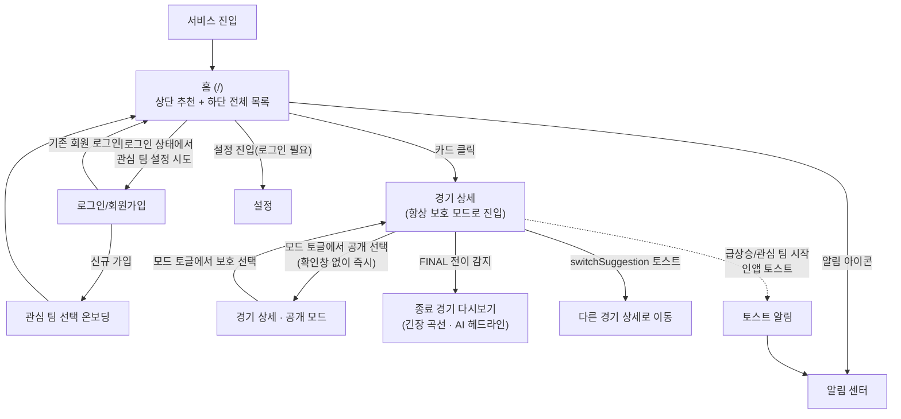

# 사용자 흐름과 화면 설계

## 1. 사용자와 진입 경로

| 사용자 | 로그인 | 진입 후 기본 경험 |
|---|---|---|
| 비로그인 방문자 | X | 홈에서 전체 추천을 보고, 경기 상세까지 자유롭게 본다. 관심 팀 가산·알림·알림 센터는 없다. |
| 신규 가입자 | 가입 직후 | 관심 팀 선택 온보딩을 거친 뒤 홈으로 이동한다. |
| 기존 로그인 사용자 | O | 홈 진입 시 관심 팀/선수 가산이 적용된 순서로 카드를 본다. |

## 2. 전체 사용자 여정



## 3. 공통 UI 요소

### 3.1 경기 상태 배지

경기 상태는 어느 화면에서든 같은 방식으로 표기한다.

| 상태 | 배지 텍스트 | 위치 |
|---|---|---|
| 예정 | `예정 · 7/9 08:05` 형태로 시작 시각 표기 | 카드 상단 |
| 진행 중 | `LIVE` + 이닝 숫자(예: `LIVE · 8회`) | 카드 상단, 상세 헤더 |
| 종료 | `종료` | 카드 상단 |

### 3.2 추천 카드 구조 (홈 상단/하단 공통)

```
┌─────────────────────────────┐
│ [상태 배지]                  │
│ 어웨이팀  @  홈팀             │  ← 매치업(팀 약어 또는 전체 이름)
│ [태그 칩] [태그 칩]           │  ← 추천 이유 태그, 최대 2개
│ (상태별 부가 정보 1줄)        │  ← 아래 표 참고
└─────────────────────────────┘
```

| 상태 | 부가 정보 1줄 | 예시 |
|---|---|---|
| 예정 | 구장, 선발 투수 | `Yankee Stadium · 선발 미확정` |
| 진행 중 | (배지에 이닝 포함, 추가 줄 없음) | — |
| 종료 | 다시보기 구간 수 + AI 헤드라인(보호 모드용, 있을 때만. 카드는 항상 보호 모드) | `다시보기 2개 구간 · "다시 볼 만한 흐름이 있었던 경기입니다."` / 헤드라인이 없으면 `다시보기 2개 구간` |

카드 전체가 클릭 영역이며, 클릭하면 항상 보호 모드로 경기 상세에 진입한다. 카드 자체에는 모드 전환 컨트롤을 두지 않는다(모드 전환은 상세 화면의 토글에서만 가능).

### 3.3 추천 이유 태그 칩

태그는 색이 아닌 텍스트 칩으로 표기하고, 결과 방향을 드러내지 않는 문구만 쓴다(예: `접전 흐름`, `득점권 압박`, `후반 긴장 구간`, `순위 경쟁`, `관심 팀`). 카드에는 우선순위 상위 최대 2개만 노출하고, 상세 화면에서는 전체를 노출한다. 정의된 태그 전체 목록·카드/상세 사용 위치·우선순위 규칙은 SPOILER_POLICY.md §7을 따른다.

### 3.4 추천 사이드바 (경기 상세 전용)

경기 상세 화면 오른쪽에 홈 상단 추천 영역과 동일한 목록을 상시 패널로 보여준다. `switchSuggestion` 토스트(§3.5)와 역할이 다르다.

| 구분 | 추천 사이드바 | `switchSuggestion` 토스트 |
|---|---|---|
| 성격 | 상시 노출되는 탐색용 패널 | 실시간으로 튀어나오는 1회성 제안 |
| 내용 | 홈 상단 추천 목록 전체(최대 5장, 지금 보고 있는 경기는 제외) | 지금 경기보다 훨씬 더 볼 만해진 경기 1개 |
| 갱신 | 홈과 동일하게 `ranking_changed` 수신 시 조용히 재조회 | 상세 조회 응답의 `switchSuggestion` 값이 있을 때만 표시 |

```
┌───────────────────────────────┬─────────────┐
│                                 │ 다른 볼 만한 │
│         경기 상세 본문          │ 경기         │
│      (§4.2~4.6 레이아웃)        │ [카드]       │
│                                 │ [카드]       │
│                                 │ [카드]       │
│                                 │ [카드]       │
└───────────────────────────────┴─────────────┘
```

- 데스크톱(오른쪽 컬럼 확보 가능)에서만 사이드바로 노출한다.
- 모바일에서는 오른쪽 컬럼이 없으므로 본문 하단에 "다른 볼 만한 경기" 섹션으로 내려서 붙인다(별도 화면 이동 없이 스크롤로 확인).
- 사이드바 카드도 §3.2 카드 구조·클릭 규칙을 그대로 따른다(클릭 시 보호 모드로 해당 경기 상세 진입).

### 3.5 토스트

| 종류 | 트리거 | 문구 예시 | 클릭 시 |
|---|---|---|---|
| 급상승 알림 | SURGE 이벤트 수신 | `지금 볼 만한 경기가 있어요 — 접전 흐름` | 해당 경기 상세로 이동 |
| 관심 팀 시작 알림 | 관심 팀 경기 진행 중 전환 | `관심 팀 경기가 시작됐어요 — SD @ CHC` | 해당 경기 상세로 이동 |
| 경기 전환 안내 | 상세 화면에서 `switchSuggestion` 수신 | `지금은 다른 경기가 더 볼 만해요 — 후반 긴장 구간` | 제안 경기 상세로 이동, 무시하면 자동 소멸 |

토스트는 화면 상단에 나타나 몇 초 후 자동으로 사라지며, 별도 확인 버튼을 요구하지 않는다.

### 3.6 모드 토글 (경기 상세 전용)

진행 중·종료 경기 상세 화면 상단에 `[보호 | 공개]` 세그먼트 토글을 상시 표시한다.

- 두 모드가 항상 함께 보이고, 현재 모드가 하이라이트된다(라벨이 바뀌는 단일 버튼이 아니다).
- 다른 쪽 세그먼트를 누르면 확인창(alert/confirm/dialog) 없이 그 자리에서 즉시 전환된다.
- 예정 경기 상세에는 토글을 노출하지 않는다(공개할 결과 자체가 아직 없음).
- 공개 상태는 이 브라우저(로컬)에만 경기 단위로 저장된다. 새로고침해도 유지되지만 다른 기기에는 적용되지 않으며, 카드에서 다시 진입하면 기본값은 보호 모드다(§F3).

## 4. 화면별 상세

### 4.1 홈 (`/`)

**목적**: 지금 볼 만한 경기를 가장 먼저 보여주고, 하루 전체 경기를 탐색할 수 있게 한다.

**레이아웃 — 상단 추천은 가로 스크롤 대신 비대칭(bento) 그리드로 배치한다.** 슬롯 채우기 순서(§F2, 진행 중 → 종료 → 예정)로 정해진 1번째 카드를 가로·세로 2배 크기의 히어로 카드로 키우고, 나머지 카드는 그 옆(데스크톱) 또는 아래(모바일)에 작은 카드로 채운다. 카드 크기 자체가 우선순위를 드러내며, 스크롤 없이 5장이 한 화면에 들어온다.

```
┌───────────────────────────────────────────┐
│ 헤더: 로고 · (로그인 시) 알림 아이콘 · 설정   │
├───────────────────────────────────────────┤
│ "지금 볼 만한 경기"                          │
│ ┌───────────────────┬─────────┬─────────┐  │
│ │                     │ [카드 2] │ [카드 3] │  │
│ │     [카드 1 · 대]    ├─────────┼─────────┤  │
│ │   (1순위, 2배 크기)   │ [카드 4] │ [카드 5] │  │
│ └───────────────────┴─────────┴─────────┘  │
├───────────────────────────────────────────┤
│ ◀ 2026-07-09 (오늘) ▶     [달력 아이콘]      │
│ [전체] [예정] [진행] [종료]   [추천순 ▾]      │
│ ─────────────────────────────────────────  │
│ [리스트 카드]                                │
│ [리스트 카드]                                │
│ [리스트 카드]                                │
│ ...                                         │
└───────────────────────────────────────────┘
```

모바일 폭에서는 카드 1(히어로)이 전체 폭을 차지하고, 카드 2~5는 그 아래 2×2 그리드로 배치한다(가로 스크롤 없이 세로로만 이어진다).

**상단 추천 영역 실 데이터 예시** (2026-07-09, 상태별 슬롯이 섞여 최대 5장 — 카드 1이 히어로)

```
┌─────────────────────────────┬───────────────┐
│ [LIVE · 8회]                  │ [예정 · 23:05] │
│ SD  @  CHC                    │ BOS  @  NYY    │
│ [접전 흐름] [득점권 압박]        │ [순위 경쟁]     │
│ (오늘 가장 볼 만한 경기 · 히어로) ├───────────────┤
│                                │ [종료]         │
│                                │ SF  @  LAD     │
│                                │ [후반 긴장 구간] │
│                                │ 다시보기 2개 구간 │
└─────────────────────────────┴───────────────┘
```

**하단 전체 경기 목록 실 데이터 예시** (상태 탭 "전체", 시작 시각순, 진행 중 상단 고정)

```
LIVE · 8회      SD  @  CHC     [접전 흐름] [득점권 압박]
예정 · 23:05    BOS @  NYY     [순위 경쟁]   Yankee Stadium · 선발 Cole
종료            SF  @  LAD     [후반 긴장 구간]  다시보기 2개 구간
```

**상태**

| 상태 | 표시 |
|---|---|
| 로딩 | 카드 자리에 스켈레톤 표시 |
| 상단 추천 없음 | 상단 영역 자체를 숨기고 하단 목록만 표시 |
| 선택한 슬레이트에 경기 없음 | 하단 목록에 "이 날짜에는 예정된 경기가 없어요" 안내 |
| SSE `ranking_changed` 수신 | 그리드 안에서 카드 위치를 부드럽게 재정렬(순간 이동이 아니라 위치 이동 애니메이션). 1순위가 바뀌면 새 1순위 카드가 히어로 크기로, 기존 히어로는 작은 카드 크기로 전환된다 |

**인터랙션**

- 카드 클릭 → 해당 경기 상세(보호 모드)로 이동.
- 날짜 화살표 클릭 → 하루 단위 이동, 달력 아이콘 클릭 → 임의 날짜 피커.
- 상태 탭 전환 → 목록만 갱신(상단 추천 영역은 유지).
- 정렬 드롭다운은 상태 탭이 "전체"일 때 비활성화(항상 시작 시각순 고정이라는 안내 텍스트 표시).

### 4.2 경기 상세 · 예정 (`/games/:id`, 예정)

```
┌───────────────────────────────────────────┐
│ ← 뒤로       [예정 · 7/10 08:05]             │
│ BOS  @  NYY                                 │
│ Yankee Stadium                              │
│ 선발: BOS 미확정 · NYY 미확정                │
│ [순위 경쟁]                                  │
│ ★ 관심 선수 선발 여부 (관심 선수 등록 시)      │
└───────────────────────────────────────────┘
```

예정 경기는 모드 토글(§3.6)을 노출하지 않는다. 데스크톱에서는 §3.4의 추천 사이드바가 본문 오른쪽에 붙는다.

### 4.3 경기 상세 · 진행 중 · 보호 모드 (기본 진입 상태)

**데스크톱 레이아웃**(본문 + 추천 사이드바, §3.4)

```
┌───────────────────────────────┬─────────────┐
│ ← 뒤로        모드 [●보호 | 공개]│ 다른 볼 만한 │
│ SD  @  CHC        LIVE · 8회    │ 경기         │
│ 아웃 2·볼 3·스트라이크 2·득점권   │ ┌─────────┐ │
│ [접전 흐름] [득점권 압박]         │ │예정      │ │
│ ────────────────────────────  │ │BOS @ NYY │ │
│ 흐름 변화                       │ │[순위 경쟁]│ │
│  · 8회 득점권 압박 — 긴장감...   │ └─────────┘ │
│  · 6회 흐름 급변 — ...          │ ┌─────────┐ │
│ ────────────────────────────  │ │종료      │ │
│ 주요 순간                       │ │SF @ LAD  │ │
│  · 7회 만루 승부                │ │[후반 긴장]│ │
│  · 5회 강한 타구                │ └─────────┘ │
│ ────────────────────────────  │              │
│ ★ 오타니 선수 출전 중            │              │
└───────────────────────────────┴─────────────┘
```

**모바일 레이아웃**(추천 사이드바는 본문 하단으로 이동)

```
┌───────────────────────────────────────────┐
│ ← 뒤로                  모드 [●보호 | 공개]  │  ← 세그먼트 토글, 즉시 전환(§3.6)
│ SD  @  CHC            LIVE · 8회             │
│ 아웃 2 · 볼 3 · 스트라이크 2 · 득점권 주자 있음 │
│ [접전 흐름] [득점권 압박]                     │
├───────────────────────────────────────────┤
│ 흐름 변화                                    │
│  · 8회  득점권 압박 — 긴장감 있는 흐름이 감지됐어요│
│  · 6회  흐름 급변 — ...                       │
├───────────────────────────────────────────┤
│ 주요 순간                                    │
│  · 7회  만루 승부                            │
│  · 5회  강한 타구                            │
├───────────────────────────────────────────┤
│ ★ 오타니 선수 출전 중 (관심 선수 등록 시)      │
├───────────────────────────────────────────┤
│ 다른 볼 만한 경기                             │
│ [카드] [카드] [카드]                          │
└───────────────────────────────────────────┘
```

노출 항목: 매치업, 이닝 숫자, 아웃·볼카운트, 득점권/만루 여부, 추천 이유 태그, 태그 변화 히스토리, 흥미 순간 이벤트 타임라인(보호 안전 이벤트만), 관심 선수 출전 여부. 점수·이닝 초/말·승패·play 원문·현재 타자/투수는 어떤 요소에도 없다(현재 타자의 소속팀이 곧 공격팀 정보이므로 보호 모드에서는 표기하지 않는다). 이닝 교대 중에는 아웃·볼카운트 영역에 `이닝 교대 중`을 대신 표기한다. 이 데스크톱/모바일 사이드바 배치는 §4.2·4.4·4.5·4.6 모든 상세 화면에 동일하게 적용되며, 이후 화면은 본문 영역만 표시한다.

### 4.4 경기 상세 · 진행 중 · 공개 모드

토글에서 `공개`를 누르면 다이얼로그 없이 그 자리에서 화면이 즉시 전환된다.

```
┌───────────────────────────────────────────┐
│ ← 뒤로                  모드 [보호 | ●공개]  │
│ SD 4  @  CHC 3          LIVE · 8회 초        │
│ 아웃 2 · 볼 3 · 스트라이크 2 · 득점권 주자 있음 │
│ 현재 타석 — 타자 Kim vs 투수 Steele           │
│ [접전 흐름] [득점권 압박]                     │
├───────────────────────────────────────────┤
│ 최근 플레이                                  │
│  · 8회 초  스트라이크아웃 (2아웃)             │
│  · 8회 초  2루타, 1점 득점 (SD 4 - 3)         │
│  ...                                        │
├───────────────────────────────────────────┤
│ 이닝별 점수표                                │
│  1 2 3 4 5 6 7 8 | R H E                    │
│  SD  0 1 0 2 0 0 1 0 | 4 8 1                │
│  CHC 0 0 1 0 2 0 0 0 | 3 7 0                │
└───────────────────────────────────────────┘
```

공개 모드는 보호 모드 항목 전체에 점수, 이닝 초/말, 현재 타자/투수, play 타임라인(원문), 타석 결과, 이닝별 점수, 공개 전용 이벤트를 더해서 보여준다. 이닝 교대 중에는 현재 타석 줄을 표시하지 않는다. 전환은 §3.6 토글 규칙을 따른다.

### 4.5 경기 상세 · 종료 · 보호 모드

```
┌───────────────────────────────────────────┐
│ ← 뒤로                  모드 [●보호 | 공개]  │
│ SF  @  LAD                       [종료]     │
│ "다시 볼 만한 흐름이 있었던 경기입니다."       │  ← AI 헤드라인, 있을 때만 렌더링
├───────────────────────────────────────────┤
│ 긴장 곡선                                    │
│                                             │
│      ▄▄        ▂▄█▇                         │
│  ▁▂▄████▄▂▁▂▄██████                         │
│  ─┬──┬──┬──┬──┬──┬──┬──┬──┬─                │
│   1  2  3  4  5  6  7  8  9   (이닝)         │
│      └─░░░░░─┘     └─░░─┘  ← 다시보기 구간 밴드│
│        ◆        ◆      ◆   ← 주요 순간 마커   │
├───────────────────────────────────────────┤
│ 다시보기 구간 (2)                            │
│  · 5회 ~ 7회   [후반 긴장 구간] [흐름 변화]    │
│  · 8회 ~ 9회   [득점권 압박]                  │
├───────────────────────────────────────────┤
│ 주요 순간 (보호 안전 이벤트만)                │
└───────────────────────────────────────────┘
```

**긴장 곡선 규칙** (전체 정책은 SPOILER_POLICY.md §5 예외 조항)

- 종료 경기에서만 표시한다. 진행 중·예정 화면에는 곡선 영역 자체가 없다.
- 보호 모드는 이닝 단위, 공개 모드는 하프이닝 단위 해상도로 그린다. 서버가 1~5단계로 양자화한 레벨 값만 내려주며, 세로축에는 눈금·숫자를 표기하지 않는다(가로축 이닝 라벨은 허용).
- 다시보기 구간은 곡선 위 음영 밴드로, 주요 순간 이벤트는 곡선 위 마커로 얹는다. 밴드를 탭하면 하단 구간 목록의 해당 구간이 하이라이트되고, 마커를 탭하면 보호 표기 라벨이 툴팁으로 뜬다.
- AI 헤드라인은 모드마다 별도로 생성한 문구다. 보호 모드 헤드라인은 결과를 드러내지 않는 안전 문구이고, 공개 모드 헤드라인은 최종 점수·승패를 반영한 문구다(§4.6 예시 참고). **기본 문구는 없다** — 헤드라인이 아직 없으면 헤드라인 영역 자체를 렌더링하지 않으며, 나머지 영역의 높이·배치는 그대로 유지한다. 생성이 완료되면 `game_updated` 재수신 시 빈 자리에 문구가 나타난다.
- 구간별 문구(AI 요약)는 없다. 구간은 이닝 범위와 태그 칩으로만 설명한다.
- **진행 중·예정 경기 화면에는 헤드라인·곡선 영역 자체가 존재하지 않는다.**

**상태**

| 상태 | 표시 |
|---|---|
| AI 헤드라인 없음 | 헤드라인 영역 미렌더링(레이아웃 유지) |
| 곡선 데이터 없음(점수 이력 미확보 경기) | 곡선 영역 미렌더링, 구간 목록·주요 순간만 표시 |
| 다시보기 구간 없음 | "다시 볼 만한 구간이 감지되지 않았어요" 안내 1줄 |

### 4.6 경기 상세 · 종료 · 공개 모드

토글에서 `공개`를 누르면 즉시 전환된다.

```
┌───────────────────────────────────────────┐
│ ← 뒤로                  모드 [보호 | ●공개]  │
│ SF 3  @  LAD 5                    [종료]    │
│ "LAD가 8회 대량 득점으로 SF를 5-3으로        │  ← 공개 모드 전용 헤드라인
│  제압한 경기입니다."  (있을 때만 렌더링)       │     (최종 결과 반영)
├───────────────────────────────────────────┤
│ 긴장 곡선 (하프이닝 단위) + 구간 밴드 + 마커   │
│ (마커는 공개 전용 이벤트 포함, 탭 시 결과 표기) │
├───────────────────────────────────────────┤
│ 이닝별 점수표                                │
├───────────────────────────────────────────┤
│ 득점 장면 (plays의 득점 play 목록)            │
│  · 8회 말  3점 홈런 (LAD 5 - 3)              │
│  · 4회 초  적시타 (SF 2 - 1)                 │
├───────────────────────────────────────────┤
│ 다시보기 구간 (2) — 구간 클릭 시 해당 구간    │
│ 상세 타임라인(점수 포함)으로 이동             │
└───────────────────────────────────────────┘
```

### 4.7 온보딩 · 관심 팀 선택 (회원가입 Step 2)

```
┌───────────────────────────────────────────┐
│ 관심 있는 팀을 선택해주세요 (최대 3팀)        │
│ [NYY] [BOS] [LAD] [SF] [CHC] [SD] ...       │
│                                             │
│                 [건너뛰기]   [완료]          │
└───────────────────────────────────────────┘
```

관심 팀은 최대 3팀까지 선택할 수 있다. 선택 없이 건너뛰어도 홈 이용에는 제약이 없다(가산만 없음). "완료" 클릭 시 홈으로 이동하며 이후 설정에서 언제든 변경할 수 있다.

### 4.8 로그인 / 회원가입 (`/login`, `/signup`)

이메일·비밀번호 입력 폼과 전환 링크("계정이 없으신가요? 회원가입")만 있는 단순 폼 화면이다. 소셜 로그인은 제공하지 않는다.

### 4.9 알림 센터 (`/notifications`, 로그인 필요)

```
┌───────────────────────────────────────────┐
│ 알림                                        │
│ ● 지금 볼 만한 경기가 있어요 — 접전 흐름      │
│   SD @ CHC · 3분 전                         │
│ ○ 관심 팀 경기가 시작됐어요                  │
│   BOS @ NYY · 1시간 전                      │
│ ○ ...                                       │
└───────────────────────────────────────────┘
```

`●`는 미읽음, `○`는 읽음. 항목 클릭 시 읽음 처리와 함께 해당 경기 상세로 이동한다. 최신순으로 정렬하고 7일이 지난 항목은 노출하지 않는다.

### 4.10 설정 (`/settings`, 로그인 필요)

```
┌───────────────────────────────────────────┐
│ 관심 팀        [NYY] [SD] [+ 추가]          │
│ 관심 선수      [Shohei Ohtani] [+ 추가]     │
│ ─────────────────────────────────────────  │
│ 관심 팀 경기 시작 알림          [켬 ●──]     │
│ 급상승 경기 알림                [켬 ●──]     │
│ 경기 전환 추천                  [켬 ●──]     │
└───────────────────────────────────────────┘
```

종료 경기 추천 표시 여부 설정은 없다 — 종료 슬롯은 다른 상태와 동일한 규칙으로 항상 채워진다. 스포일러 공개 모드의 계정 단위 기본값 설정도 없다 — 공개 상태는 브라우저 로컬에만 저장된다(§3.6, §F3).

## 5. 인터랙션 규칙 모음

| 규칙 | 내용 |
|---|---|
| 모드 토글 | 진행 중·종료 상세 상단에 `[보호 | 공개]` 세그먼트 토글이 상시 표시된다(예정 경기 제외). 두 모드가 항상 함께 보이고 현재 모드가 하이라이트되며, 다른 쪽을 누르면 확인창 없이 즉시 전환된다. |
| 카드 → 상세 진입 | 항상 보호 모드로 진입한다. 직전에 같은 경기를 공개 모드로 봤어도 카드에서 다시 들어오면 보호 모드부터 시작한다(§F3, 경기 단위 로컬 저장이지만 진입 시 기본값은 보호). |
| 실시간 갱신 | 홈은 `ranking_changed`, 상세는 `game_updated` 수신 시 화면이 알림 없이 조용히 재조회되어 갱신된다(로딩 스피너 전체 화면 노출 없음). |
| FINAL 전이 | 상세 화면을 보던 중 경기가 종료되면 자동으로 다시보기 화면 구성(§4.5)으로 바뀐다(페이지 이동이 아니라 같은 화면 내 콘텐츠 전환). 종료 직후 AI 헤드라인은 비어 있을 수 있으며, 생성·저장이 완료되면 `game_updated` 재발행으로 빈 자리에 문구가 나타난다. |
| 경기 전환 안내 | 토스트로만 제공하며 자동 이동은 하지 않는다. 사용자가 클릭해야 이동한다. |
